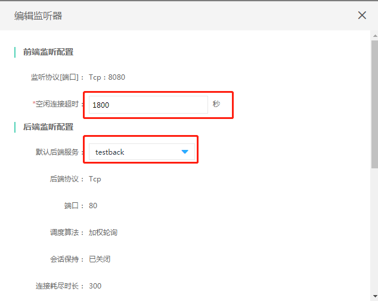

# 监听器管理

监听器管理用来指导您新建一个监听器和管理已有监听器。
- 新建监听器：新建监听器向导将指引您如何新建一个监听器。该向导包括前端监听配置、后端转发配置、健康检查配置和后端服务器组配置四部分。
- 管理监听器：您可以对已有监听器进行启用/禁用、编辑、删除等操作。

## 操作步骤

### 步骤一：前端监听配置

### 步骤一：前端监听配置

 1.您可以在网络负载均衡列表页通过以下两种方式，进入监听器列表页。
 
   - 点击 **名称**  栏下的指定网络负载均衡，进入该网络负载均衡详情页。点击 **监听器** 页签，进入监听器列表页。
   - 点击 **操作** 栏下的 **添加监听** 链接，进入监听器列表页。

 2.点击 **新建监听器** 按钮，在弹出的配置向导对话框中配置监听协议、端口及空闲连接超时，点击 **下一步** 进入后端转发配置页签。
 
 | 参数	| 说明	| 
| :- | :- |
|监听协议	|前端的监听协议，目前仅支持TCP|
|端口	|前端的监听端口，输入范围为1-65535，同一NLB下，监听端口不能重复|
|空闲连接超时|输入范围为1-86400秒，默认1800秒|
 
     注意：监听协议和端口配置后不允许修改。
     
### 步骤二：后端转发配置
#### 3. 监听器设置：
	
##### 前端监听配置：
	
- 选择前端监听协议：tcp；端口：1~65535【注：同一负载均衡下的监听端口不可重复，监听器创建后，监听协议、端口不允许修改】；	

- 空闲连接超时：输入范围1~86400秒，默认1800秒。

  

##### 后端转发配置：

- 默认后端服务：新建或选择一个已有的后端服务，选择已有后端服务相关参数不可修改；

- 后端服务名称：定义后端服务名称，随监听器同步创建的后端服务可在后端服务列表查看；	
	
- 后端协议：默认显示，监听协议为tcp则后端协议为tcp；
	
- 端口：后端业务转发端口，输入范围1~65535，不同后端服务的端口可以重复；
	
- 调度算法：加权轮询、加权最小连接数、源IP，可根据实际业务需求选择；

- 会话保持：默认关闭，打开支持基于TCP的会话保持，缺省时间为300秒；	
	
- 连接耗尽：配置连接耗尽超时时间，范围为【0，3600】秒，缺省为300秒。

  	

##### 健康检查设置：

- 选择健康检查方式：HTTP、TCP；
	
- 设置检查端口：输入范围1~65535，如不填写默认为后端实例接收负载均衡流量的端口；
	
- 响应超时时间(s)：输入范围2~60秒,此为健康检查响应的最大超时时间；
	
- 健康检查间隔(s):输入范围为5~300秒,此为健康检查的时间间隔；
	
- 不健康阈值：输入范围1~5，此为后端实例从成功到失败的连续健康检查失败次数；
	
- 健康阈值：输入范围1~5，此为后端实例从失败到成功的连续健康检查成功次数；
	
- 正常态码：输入范围2xx（等价于200-299）、3xx（等价于300-399）、4xx（等价于400-499）；
	
- 检查路径：仅健康检查方式为HTTP时填写，必须以“/”开头、最多支持5级目录，不得超过100字符。

##### 添加服务器组：

- 选择服务器组类型：虚拟服务器、高可用组，或者可以暂不添加；
	
- 选择虚拟服务器组：系统会自动筛选出当前可以绑定的服务器组列表，如没有可用的服务器组，可点击“新建虚拟服务器组”进行创建【注：可选服务器组中的后端实例必须与负载均衡处于相同地域、私有网络、可用区下。】；	

- 高可用组：系统会自动筛选出当前可以绑定的高可用组，如没有可用的高可用组，请前往高可用组页面进行创建；注：可选高可用组中的后端实例必须与负载均衡处于相同地域、私有网络、可用区下。

## 管理监听器

#### 1. 查看监听详情：通过监听器列表页-操作栏，点击详情可查看监听器详细信息；

#### 2. 启用/禁用监听器：通过监听器列表页-操作栏，可启用、禁用监听器；

#### 3. 编辑监听器：通过监听器列表页-操作栏，可编辑监听器内容（详见下文）；

#### 4. 删除监听器：通过监听器列表页-操作栏，可删除监听器。

	
## 编辑监听器

#### 1. 空闲连接超时：可修改；

#### 2. 默认后端服务：可替换新的后端服务【注：只能选择与监听器协议匹配的后端服务，如监听协议为tcp，则可选后端协议为tcp的后端服务】；

#### 3. 其他参数项不支持修改。

	

