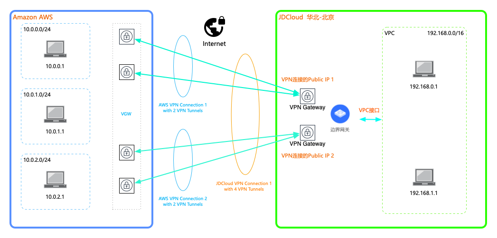

## VPN连接到亚马逊AWS
本教程将为您介绍如何通过京东智联云IPsec VPN，建立京东智联云VPC到亚马逊AWS VPC的内网安全访问。

### 业务场景
客户基于业务可用性的角度考虑，将业务部署到多个公有云厂商提供的服务中，多个云厂商的业务之间需要互相访问或实现故障切换/灾备。</br>


### 前置条件
京东智联云VPC内的网段与Amazon AWS VPC内的网段不能重叠。

### 详细步骤
###### 步骤1.在京东智联云创建边界网关

a)登录[边界网关控制台](https://cns-console.jdcloud.com/host/borderGateway/list)；  </br>
b)选择使用VPN的地域，点击创建边界网关；</br>
c)边界网关支持运行BGP路由协议，当前边界网关的BGP ASN固定为65000，后续会开放修改；</br>

更多内容，详见[边界网关管理](../Operation-Guide/Border-Gateway-Management/Border-Gateway-Configuration.md).

###### 步骤2.在京东智联云创建VPC接口
a)登录[VPC接口控制台](https://cns-console.jdcloud.com/host/vpcAttachment/list)；  </br>
b)选择使用VPN的地域，点击创建VPC接口；</br>
c)选择步骤1中创建的边界网关，选择要通过该边界网关路由流量的VPC，选择要传播到该边界网关中的VPC网段，创建VPC接口后，被选择的网段将自动添加到该边界网关的传播路由表中，下一跳指向此步骤创建的VPC接口；</br>

更多内容，详见[VPC接口管理](../Operation-Guide/Border-Gateway-Management/VPC-Attachment-Configuration.md)。

###### 步骤3.在京东智联云创建客户网关
a)登录[客户网关控制台](https://cns-console.jdcloud.com/host/customerGateway/list)；  </br>
b)选择使用VPN的地域，点击创建客户网关；</br>
c)客户网关是客户端VPN设备在云端的逻辑表示，客户将基于边界网关和客户网关创建VPN连接。客户网关本身仅代表客户端设备的相关信息(``只涉及公网地址和BGP ASN，无具体地理位置的概念``)，理论上并没有地域的属性，但由于云内资源几乎都有地域的属性，故也为客户网关分配了地域属性。相同配置的客户网关可以在不同地域重复创建，仅在创建资源的地域内可用，地域之间互不影响。</br>
d)若客户端设备支持BGP路由协议，推荐使用BGP路由，此处请指定客户端的BGP ASN；</br>
e)客户端配置四个公网地址，并任意指定四个公网可路由的地址，待Amazon AWS的VPN Connection分配了公网地址后，需要对京东智联云的客户网关公网地址进行更新；</br>

更多内容，详见[客户网关管理](../Operation-Guide/Customer-Gateway-Management/Customer-Gateway-Configuration.md)。

###### 步骤4.在京东智联云创建VPN连接
a)登录[VPN连接控制台](https://cns-console.jdcloud.com/host/vpnConnection/list)；  </br>
b)选择使用VPN的地域，点击创建VPN连接；</br>
c)选择用于创建VPN连接的边界网关；</br>
d)选择表示客户端VPN设备的客户网关；</br>
e)选择连接类型，当前仅支持配置均为IPv4地址簇的隧道内外层地址，未来会支持IPv6地址簇；</br>
f)选择是否启用BGP路由，基于业务高可用的考虑，默认启用BGP路由，此时将基于边界网关和客户网关建立BGP会话；</br>
g)创建VPN连接后，会自动分配两个云端公网地址，用于和客户端公网地址间建立VPN隧道；</br>

更多内容，详见[VPN连接管理](../Operation-Guide/VPN-Connection-Management/VPN-Connection-Configuration.md)。

###### 步骤5.在Amazon AWS创建VPN Connection
在Amazon AWS中创建相应的资源，包括VPC、VGW，使用京东智联云VPN连接分配的两个公网地址在亚马逊创建两个CGW，并使用VGW和两个CGW分别创建两个VPN Connection，建议在VGW和CGW之间运行BGP路由协议。

###### 步骤6.在京东智联云更新客户网关的公网地址
以Amazon AWS的VPN Connection分配的四个隧道的AWS云端公网地址来更新京东智联云客户网关的四个公网地址。

###### 步骤5.在京东智联云创建VPN隧道
a)登录[VPN连接控制台](https://cns-console.jdcloud.com/host/vpnConnection/list)；  </br>
b)选择使用VPN的地域，选择VPN连接；</br>
c)点击“资源信息”Tab中的“添加隧道”，自动初始化四条隧道的创建页面，前两条隧道的两端公网地址是VPN连接的云端公网地址中的第一个，以及客户网关公网地址中的第一个和第二个，后两条隧道的两端公网地址是云端公网地址的第二个和客户网关公网地址中的第三个和第四个； </br>
d)同一VPN连接下的所有VPN隧道使用相同的路由方式，即在VPN连接上设置的路由方式；</br>
e)``按照在Amazon AWS中创建隧道配置的参数``，为每个VPN隧道分别配置两阶段协商所使用的参数，包括IKE版本、预共享密钥、隧道两端网关标识、隧道内层IP(用于隧道内路由数据包)，以及两阶段的认证算法、加密算法、SA声明周期等；</br>
```
基于安全性和性能的综合考虑，给出了默认的隧道IKE和IPsec推荐配置，建议客户按推荐配置协商建立VPN隧道。
```
f)同时创建多条隧道时，其它隧道可复用隧道1的IKE和IPsec配置参数，以简化配置过程，同时也可以自定义每个隧道的IKE和IPsec配置参数；</br>

更多内容，详见[VPN隧道管理](../Operation-Guide/VPN-Connection-Management/VPN-Tunnel-Configuration.md)。

###### 步骤7.在京东智联云配置BGP(可选)
a)京东智联云支持与VPN客户端设备之间运行EBGP路由协议，客户端设备需使用与边界网关不同的BGP ASN，京东智联云使用的BGP ASN见[边界网关的ASN](../Operation-Guide/Border-Gateway-Management/Border-Gateway-Configuration.md)；</br>
b)建立BGP使用的互联地址为隧道的内层地址，详见[VPN隧道管理](../Operation-Guide/VPN-Connection-Management/VPN-Tunnel-Configuration.md)；</br>
c)``无论是否配置BGP路由，客户都可以在边界网关上配置静态路由实现数据转发``；</br>

```
Amazon AWS中VPN的BGP配置详见其官方帮助文档；
```

###### 步骤8.在京东智联云配置路由
a)京东智联云VPN连接支持在云端和客户端之间使用静态路由/BGP动态路由，建议使用BGP动态路由实现路由自动更新；</br>
b)不同路由的配置方式：</br>
  * 配置静态路由，在边界网关的静态路由表中配置去往客户端的静态路由，目的端为客户端网段，下一跳为VPN连接。在客户端VPN设备上配置去往云端的静态路由，目的端为云端网段，下一跳为VPN隧道的接口；</br>
  * 配置BGP动态路由，边界网关和客户端VPN设备建立BGP会话后，边界网关会自动将已配置的所有路由全部发布到Peer客户端，客户端需发布客户端网段路由到Peer云端。</br>
c)无论边界网关和客户端VPN设备间运行何种路由协议，由于边界网关和VPC间创建了VPC接口并设置了路由传播，故去往客户端网段的路由也会自动传播到VPC路由表，参见[VPC接口路由传播](https://docs.jdcloud.com/cn/direct-connection/vpc-interface-features)；</br>

更多内容，详见[配置边界网关路由](../Operation-Guide/Route-Management/Border-Gateway-Route-Configuration.md)和[配置VPC路由](../Operation-Guide/Route-Management/VPC-Route-Configuration.md)。

###### 步骤9.测试连通性
a)登录[京东智联云主机控制台](https://cns-console.jdcloud.com/host/compute/list)，在创建了VPN连接的地域下，要和企业IDC内网网段互通的VPC中创建一台云主机，确认该云主机所在子网的路由表中存在正确去往企业IDC内网网段的路由；  </br>
b)使用a中创建的云主机ping Amazon AWS VPC中的一台EC2实例的内网地址，验证内网通信是否正常；</br>
