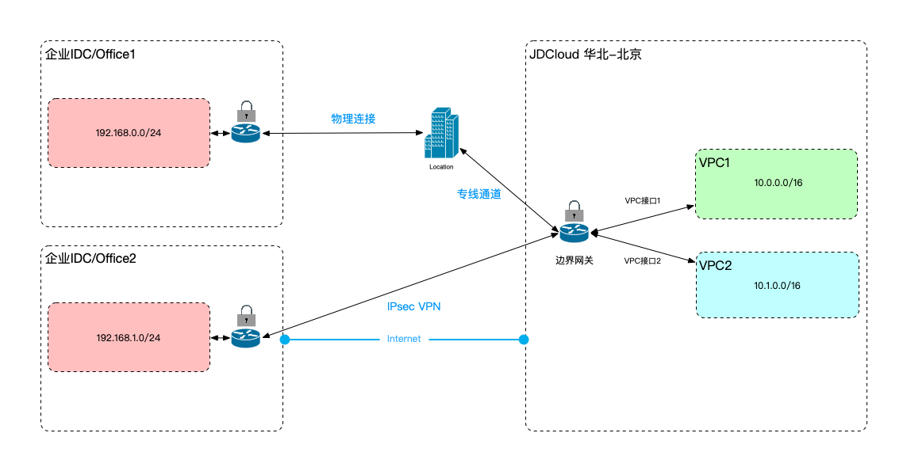

## 专线VPN混合云解决方案
本教程将为您介绍如何通过京东云专线和VPN两个服务，建立企业IDC到公有云VPC的私有连接。

### 业务场景
客户将核心/非适宜上云的业务部署在自建IDC内，非核心业务/扩展业务部署在京东云VPC内，需要通过专线和VPN打通企业IDC和公有云VPC的网络环境，实现内网通信。 

### 前置条件
* 企业IDC内的网段与公有云VPC内的网段不能重叠。
* 专线和VPN均运行BGP路由协议。

专线连接对客户端设备的要求，详见[使用专线服务需具备的条件](https://docs.jdcloud.com/cn/direct-connection/direct-connect-service-overview)。
VPN对客户端设备的要求，详见[使用限制](../Introduction/Restrictions.md)。

### 配置步骤
###### 步骤1.创建边界网关

a)登录[京东云边界网关控制台](https://cns-console.jdcloud.com/host/borderGateway/list)；   
b)选择使用服务的地域，点击创建边界网关； 
c)边界网关支持运行BGP路由协议，当前京东云边界网关的BGP ASN固定为65000，后续会开放修改； 
更多内容，详见[边界网关管理](../Operation-Guide/Border-Gateway-Management/Border-Gateway-Configuration.md)。

###### 步骤2.创建VPC接口
a)登录[京东云VPC接口控制台](https://cns-console.jdcloud.com/host/vpcAttachment/list)；   
b)选择使用服务的地域，点击创建VPC接口； 
c)选择步骤1中创建的边界网关，选择要通过该边界网关路由流量的VPC，选择要传播到该边界网关中的VPC网段，创建VPC接口后，被选择的网段将自动添加到该边界网关的传播路由表中，下一跳指向此步骤创建的VPC接口； 

更多内容，详见[VPC接口管理](../Operation-Guide/Border-Gateway-Management/VPC-Attachment-Configuration.md)。

###### 步骤3.创建专线连接
详见[创建同账号同地域专线连接](https://docs.jdcloud.com/cn/direct-connection/connect-to-the-same-account-or-region-direct-connetct)。

###### 步骤4.创建VPN连接、隧道、客户端设备、BGP
详见[企业IDC连接公有云](../Getting-Started/Connection-Into-On-Premise.md)。

###### 步骤5.配置路由
在客户端路由器设备上，通过BGP路由协议发布到云内VPC的路由，下一跳分别指向专线连接和VPN连接的接口，指定专线路由的BGP AS_PATH较VPN路由的BGP AS_PATH短，实现专线路由承载流量，当专线路由无效时使用VPN路由承载流量。

###### 步骤6.测试连通性并验证路由切换
a)登录[京东云云主机控制台](https://cns-console.jdcloud.com/host/compute/list)，在创建了服务的地域下，要和企业IDC内网网段互通的VPC中创建一台云主机，确认该云主机所在子网的路由表中存在正确去往企业IDC内网网段的路由；   
b)使用a中创建的云主机ping企业IDC内网中的一台实例的内网地址，验证内网通信是否正常； 
c)在客户端路由器上将专线的BGP会话断开，或将专线路由摘除,或将专线路由的端口置DOWN，查看流量是否切换到VPN连接上，验证有效后，再将流量切回到专线路由上； 
