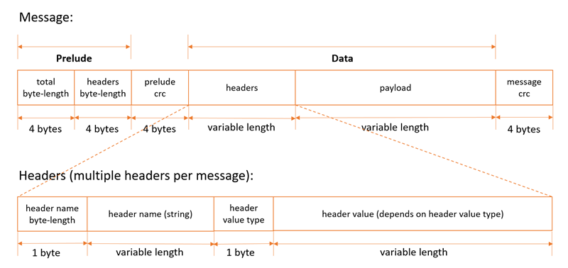
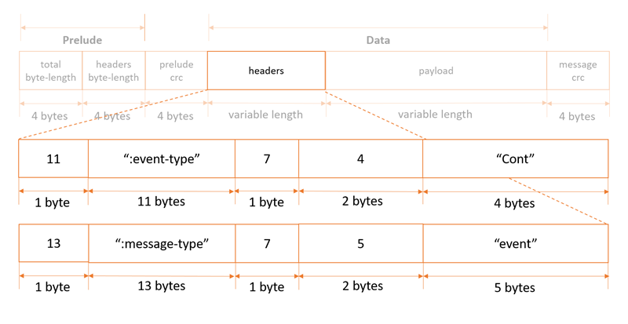
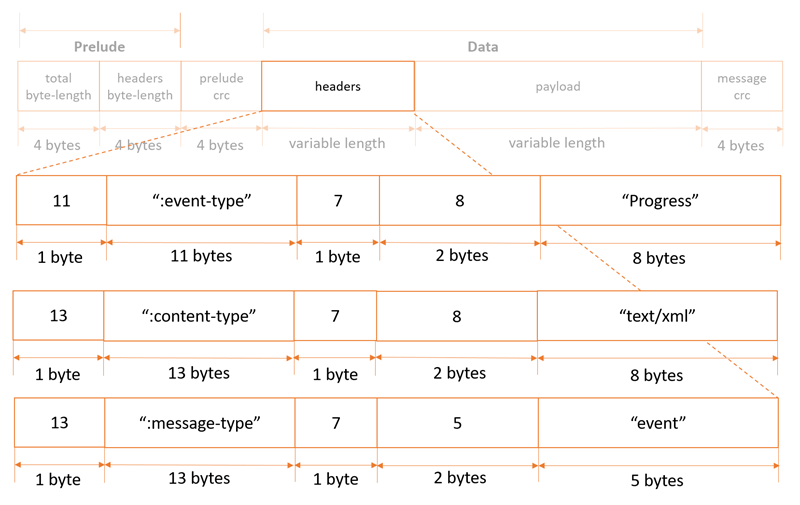
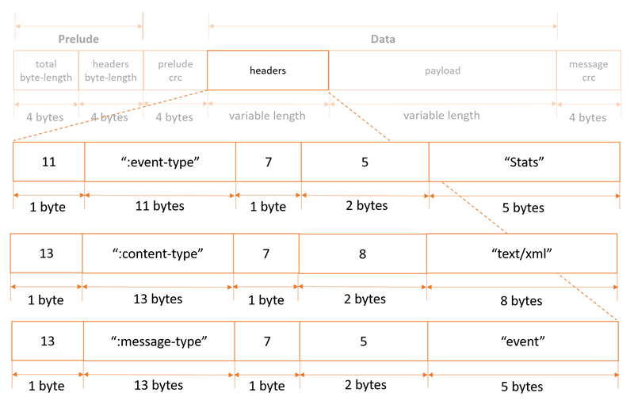

# Select Object Content
## 描述
该操作可以对文件执行SQL语句，返回执行结果。
## 请求
### 语法
```HTTP
POST /ObjectName?select&select-type=2 HTTP/1.1
Host: <BUCKET_NAME>.s3.<REGION>.jcloud-oss.com
Date: date
Authorization: authorization string (See Authenticating Requests (AWS Signature Version4))

<SelectObjectContentRequest>
   <Expression>string</Expression>
   <ExpressionType>string</ExpressionType>
   <RequestProgress>
      <Enabled>boolean</Enabled>
   </RequestProgress>
   <InputSerialization>
      <CompressionType>string</CompressionType>
      <CSV>
         <AllowQuotedRecordDelimiter>boolean</AllowQuotedRecordDelimiter>
         <Comments>string</Comments>
         <FieldDelimiter>string</FieldDelimiter>
         <FileHeaderInfo>string</FileHeaderInfo>
         <QuoteCharacter>string</QuoteCharacter>
         <QuoteEscapeCharacter>string</QuoteEscapeCharacter>
         <RecordDelimiter>string</RecordDelimiter>
      </CSV>
      <JSON>
         <Type>string</Type>
      </JSON>
   </InputSerialization>
   <OutputSerialization>
      <CSV>
         <FieldDelimiter>string</FieldDelimiter>
         <QuoteCharacter>string</QuoteCharacter>
         <QuoteEscapeCharacter>string</QuoteEscapeCharacter>
         <QuoteFields>string</QuoteFields>
         <RecordDelimiter>string</RecordDelimiter>
      </CSV>
</SelectObjectContentRequest>
```
### 请求参数
无请求参数

### 请求Header
无特殊Header

### 请求元素
名称|描述|必须
---|---|---
Expression|SQL表达式，UTF-8编码下最大256 KB<br>类型：String|是
ExpressionType|表达式类型<br>类型:String<br>有效值:SQL|是
InputSerialization|描述请求Object的格式<br>类型：容器|是
OutputSerialization|描述SELECT输出格式<br>类型：容器|是
RequestProgress|处理进度，开启后定期发送处理进度消息<br>类型：容器|否

InputSerialization 容器：
名称|描述|必须
---|---|---
CompressionType|描述请求Object的压缩类型<br>类型：String<br>有效值：NONE、GZIP<br>默认值：NONE<br>父标签：InputSerialization|否
CSV|描述请求Object的CSV格式<br>类型：容器<br>父标签：InputSerialization|否
RecordDelimiter|指定行分隔符，不能为空<br>类型：String<br>默认值：\n<br>父标签：CSV|否
FieldDelimiter|指定列分隔符，不能为空<br>类型：String<br>默认值：,<br>父标签：CSV|否
QuoteCharacter|指定引用符号，不能为空。如"a,b"，将解析为a,b<br>类型：String<br>默认值："<br>父标签：CSV|否
QuoteEscapeCharacter|指定引用转义符，不能为空。如"""a,b"""将解析为" a,b "<br>类型：String<br>默认值："<br>父标签：CSV|否
FileHeaderInfo|描述首行定义<br>类型：String<br>有效值：NONE（非列名称）<br>USE（是列名称，且可使用列名称过滤，如 SELECT "name" FROM S3Object）<br>IGNORE（是列名称，但不可使用列名称过滤，可使用_1 , _2，如SELECT _1 FROM S3Object）<br>父标签：CSV|否
Comments|指定描述字符，不能为空<br>类型：String<br>默认值：#<br>父标签：CSV|否
AllowQuotedRecordDelimiter|指定是否允许数据包含换行符。设置为TURE可能导致性能变慢<br>类型：Boolean<br>默认值：FALSE<br>父标签：CSV|否
JSON|描述请求Object的JSON格式<br>类型：容器<br>父标签：InputSerialization|否
Contents|JSON类型<br>类型：String<br>有效值：DOCUMENT、LINES<br>父标签：JSON|否


OutputSerialization 容器：
名称|描述|必须
---|---|---
CSV|描述请求Object的CSV格式<br>类型：容器<br>父标签：OutputSerialization|否
QuoteFields|描述是否使用QuoteCharacter指定的引用符号<br>类型：String<br>有效值：ALWAYS、ASNEEDED<br>默认值：ASNEEDED<br>父标签：CSV|否
RecordDelimiter|指定行分隔符，不能为空<br>类型：String<br>默认值：\n<br>父标签：CSV|否
FieldDelimiter|指定列分隔符，不能为空<br>类型：String<br>默认值：,<br>父标签：CSV|否
QuoteCharacter|指定引用符号，不能为空。如"a,b"，将解析为a,b<br>类型：String<br>默认值："<br>父标签：CSV|否
QuoteEscapeCharacter|指定引用转义符，不能为空。如"""a,b"""将解析为" a,b "<br>类型：String<br>默认值："<br>父标签：CSV|否
JSON|描述请求Object的JSON格式<br>类型：容器<br>父标签：OutputSerialization|否
Contents|JSON类型<br>类型：String<br>有效值：DOCUMENT、LINES<br>父标签：JSON|否

## 响应
### 语法
```HTTP/1.1 200
<?xml version="1.0" encoding="UTF-8"?>
<Payload>
   <Records>
      <Payload>blob</Payload>
   </Records>
   <Stats>
      <Details>
         <BytesProcessed>long</BytesProcessed>
         <BytesReturned>long</BytesReturned>
         <BytesScanned>long</BytesScanned>
      </Details>
   </Stats>
   <Progress>
      <Details>
         <BytesProcessed>long</BytesProcessed>
         <BytesReturned>long</BytesReturned>
         <BytesScanned>long</BytesScanned>
      </Details>
   </Progress>
   <Cont>
   </Cont>
   <End>
   </End>
</Payload>
```
### 响应Header
无特殊Header

### 响应body
由于响应体的大小无法预知，OSS会将响应体切分成多个消息块（message）返回。从整体看响应体的结构如下：
```
<Message 1>
<Message 2>
......
<Message n>
```

### 预响应(prelude)和响应结果(data)

响应体中的每一个消息块（message）由预响应(prelude)、响应结果(data)及其CRC校验码组成。其中，预响应包括message块的总长度、所有头部的总长度两部分；响应结果包括响应头（Headers）、响应正文（Payload）两部分；预响应和响应结果的CRC校验码都使用大端编码，用CRC32计算，占4字节。 

消息块（Message）结构如图所示，每个消息块可能包含多个 header：




### 消息块（Message）类型

消息块（Message）分为以下几类：
消息类型|描述
---|---
Records message|检索信息，根据结果长度，可能包含单条记录、部分记录或者多条记录。一个响应体可能包含多个 Records message。
Continuation message|连接信息，会周期性地返回，以保持TCP链接。建议客户端能够识别和过滤这些信息，避免脏数据影响检索结果。
Progress message|进度信息，会周期性地返回以反馈当前查询进度
Stats message|统计信息，会周期性地返回本次查询的相关统计信息
End message|结束信息，出现时代表本次查询结束
RequestLevelError message|报错信息，出现错误时返回。如果返回了该信息，将不会返回End message

### Records message

Records message 包括":message-type"， ":event-type"， ":content-type"3种报头。如图：


Records message 的正文，根据结果长度，可能包含单条记录、部分记录或者多条记录。

### Continuation message

Continuation message包括":message-type"， ":event-type"2种报头。如图：


Continuation message只有报头，没有正文信息。

### Progress Message

Progress Message包括":message-type"， ":event-type"， ":content-type"3种报头。如图：


Progress Message正文是一个XML文本，包含以下信息：
* BytesScanned：表示文件被压缩前，已经扫描过的字节数。
* BytesProcessed：文件压缩后，已经扫描过的字节数。如果文件没有被压缩，该字段与BytesScanned相同。
* BytesReturned：目前返回结果的大小。

示例如下：
```
<?xml version="1.0" encoding="UTF-8"?>
<Progress>
     <BytesScanned>512</BytesScanned>
     <BytesProcessed>1024</BytesProcessed>
     <BytesReturned>1024</BytesReturned>
</Progress>
```

### Stats Message

Stats Message包含":message-type"， ":event-type"， ":content-type"3种报头。如图：



Stats Message正文是一个XML文本，包含以下信息：
* BytesScanned：表示文件被压缩前，已经扫描过的字节数。
* BytesProcessed：文件压缩后，已经扫描过的字节数。如果文件没有被压缩，该字段与BytesScanned相同。
* BytesReturned：目前返回结果的大小。

示例如下：
```
<?xml version="1.0" encoding="UTF-8"?>
<Progress>
     <BytesScanned>512</BytesScanned>
     <BytesProcessed>1024</BytesProcessed>
     <BytesReturned>1024</BytesReturned>
</Progress>
```

### End Message

End Message包含":message-type"，":event-type"2种报头。如图：



End Message只有报头，没有正文信息。

### Request Level Error Message

Request Level Error Message包含“:error-code”，“:error-message”，“:message-type”3种报头。如图：



Request Level Error Message只有报头，没有正文信息。


## 示例
### 请求示例

```POST /exampleobject.csv?select&select-type=2 HTTP/1.1
Host: <BUCKET_NAME>.s3.<REGION>.jcloud-oss.com
Date: Tue, 17 Oct 2020 01:49:52 GMT
Authorization: authorization string
Content-Length: content length

<?xml version="1.0" encoding="UTF-8"?>
<SelectRequest>
    <Expression>Select * from S3Object</Expression>
    <ExpressionType>SQL</ExpressionType>
    <InputSerialization>
        <CompressionType>GZIP</CompressionType>
        <CSV>
            <FileHeaderInfo>IGNORE</FileHeaderInfo>
            <RecordDelimiter>\n</RecordDelimiter>
            <FieldDelimiter>,</FieldDelimiter>
            <QuoteCharacter>"</QuoteCharacter>
            <QuoteEscapeCharacter>"</QuoteEscapeCharacter>
            <Comments>#</Comments>
        </CSV>
    </InputSerialization>
    <OutputSerialization>
        <CSV>
            <QuoteFields>ASNEEDED</QuoteFields>
            <RecordDelimiter>\n</RecordDelimiter>
            <FieldDelimiter>,</FieldDelimiter>
            <QuoteCharacter>"</QuoteCharacter>
            <QuoteEscapeCharacter>"</QuoteEscapeCharacter>
        </CSV>                               
    </OutputSerialization>
</SelectRequest> 
```

### 响应示例
```HTTP/1.1 200 OK
x-req-id: 81D2740FD887DF42
x-amz-request-id: 81D2740FD887DF42
Date: Tue, 17 Oct 2020 23:54:05 GMT

A series of messages
```
