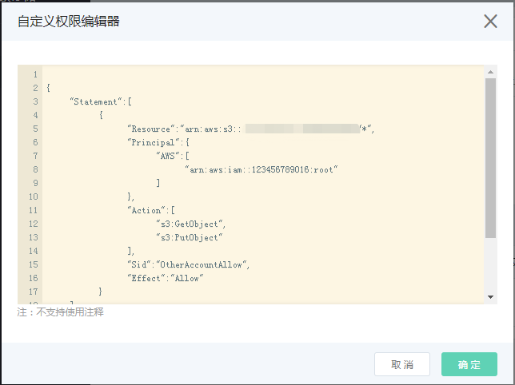

# 跨账号授权概述

OSS 资源默认都是私有的，若拥有者希望将资源共享给他人，可以通过跨账号授权的方式，将 OSS 资源授权给他人访问，下面提供下面跨账号授权访问 OSS 资源的方式。

- 基于 Bucket Policy 实现跨账号访问OSS：Bucket Policy 是基于资源的授权策略。相比于 RAM Policy，Bucket Policy 操作简单，支持在控制台直接进行图
形化配置。Bucket Policy 支持向其他账号的 IAM 用户、匿名用户等授予带特定 IP 条件限制与Referer的访问权限。
，详细介绍描述请参见[基于Bucket Policy的权限控制](../Operation-Guide/Access-Control/Access-Control-Base-On-Bucket-Policy.md)

设置方式：

* API/ADK :

[Put Bucket Policy](../../API-Reference-S3-Compatible/Compatibility-API/Operations-On-Bucket/Put-Bucket-Policy-2.md)

[Delete Bucket Policy](../../API-Reference-S3-Compatible/Compatibility-API/Operations-On-Bucket/Delete-Bucket-Policy-2.md)

[Get Bucket Policy](../../API-Reference-S3-Compatible/Compatibility-API/Operations-On-Bucket/Get-Bucket-Policy-2.md)

* 控制台设置:
1.登陆OSS控制台-空间管理-空间设置-权限设置-自定义权限


2.编辑器中，直接编辑.
Bucket policy (合法json)，大小限制16KB。



### Bucket policy策略示例
#### 1.授权跨账号对指定文件的读写权限

```
```


