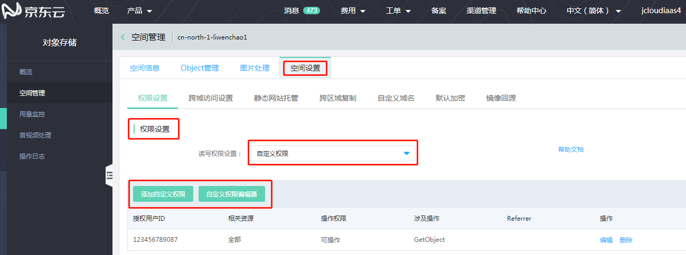

# 跨账号授权概述

OSS 资源默认都是私有的，若拥有者希望将资源共享给他人，可以通过跨账号授权的方式，将 OSS 资源授权给他人访问，下面提供下面跨账号授权访问 OSS 资源的方式。

- 基于 Bucket Policy 实现跨账号访问OSS。Bucket Policy 是基于资源的授权策略，相比于 IAM Policy，Bucket Policy 操作简单，支持在控制台直接进行图
形化配置。Bucket Policy 支持向其他账号的 IAM子用户、匿名用户等授予带特定 IP 条件限制与Referer的访问权限。
详细介绍描述请参见[基于Bucket Policy的权限控制](../Operation-Guide/Access-Control/Access-Control-Base-On-Bucket-Policy.md)。

设置方式：

* API/SDK :

[Put Bucket Policy](../../API-Reference-S3-Compatible/Compatibility-API/Operations-On-Bucket/Put-Bucket-Policy-2.md)

[Delete Bucket Policy](../../API-Reference-S3-Compatible/Compatibility-API/Operations-On-Bucket/Delete-Bucket-Policy-2.md)

[Get Bucket Policy](../../API-Reference-S3-Compatible/Compatibility-API/Operations-On-Bucket/Get-Bucket-Policy-2.md)

* 控制台设置:

1.登陆OSS控制台-空间管理-点击需要授权的Bucket-空间设置-权限设置-自定义权限



2.编辑器中，直接编辑。
Bucket policy (合法json)，大小限制16KB。


### Bucket policy策略示例
#### 1.授权跨账号对指定文件的读写权限
场景：企业帐号A，该账号拥有一个对象 Object1，在名为 Bucket1 的存储空间的 dir1 目录下。另外一个企业帐号(accoutID:123334444455)，需要拥有上述对象的读写权限。

```
 {
	"Version": "2012-10-17",
	"Id": "BucketId",
	"Statement": [{
		"Sid": "OtherAccountAllow",
		"Effect": "Allow",
		"Principal": {
			"AWS": [
				"arn:aws:iam::123334444455:root"
			]
		},
		"Action": ["s3:GetObject", "s3:PutObject"],
		"Resource": "arn:aws:s3:::Bucket1/dir1/Object1"
	}]
}
```
#### 2.授权子账号对特定Bucket的读写权限
场景：企业帐号A（accoutID: 123456789012），该账号拥有名为 Bucket1 的存储空间，希望授权其名为user1子账号的读写任何对象空间权限。

```
 {
	"Version": "2012-10-17",
	"Id": "BucketId",
	"Statement": [{
		"Sid": "SubAccountAllow",
		"Effect": "Allow",
		"Principal": {
			"AWS": [
				"arn:aws:iam::123456789012:user/user1"
			]
		},
		"Action": ["s3:GetObject", "s3:PutObject"],
		"Resource": "arn:aws:s3:::Bucket1/*"
	}]
}
```
#### 3.授权跨账号的子账号对指定文件的读写权限

企业帐号A（accoutID: 123456789012）,该账号拥有名为 Bucket1 的存储空间。另外一个企业帐号B(accoutID:123334444455)名为子账号user2，需要拥有企业帐号A，Bucket1中dir1 目录下对象的读写权限。

这里涉及权限传递，首先企业帐号A需要利用Bucket Policy授予企业帐号B读取该目录下对象的权利。其次，子账号user2必须通过IAM policy 显式的被授予访问Bucket1中dir1 目录的权限。

步骤 1：企业帐号A（accoutID: 123456789012）通过Bucket policy 为企业帐号B(accoutID:123334444455)授予读取Bucket1中dir1 目录下对象的读写权限。

```
{
	"Version": "2012-10-17",
	"Id": "BucketId",
	"Statement": [{
		"Sid": "OtherAccountAllow",
		"Effect": "Allow",
		"Principal": {
			"AWS": [
				"arn:aws:iam::123334444455:root"
			]
		},
		"Action": [
			"s3:GetObject",
			"s3:PutObject"
		],
		"Resource": "arn:aws:s3:::Bucket1/dir1/*"
	}]
}
```

步骤 2：企业帐号(accoutID:123334444455)必须通过IAM policy 显示的授予子账号user2访问Bucket1中dir1 目录的权限。

```
{
	"Statement": [{
		"Action": [
			"oss:GetObject",
			"oss:PutObject",
			"oss:AbortMultipartUpload"
		],
		"Effect": "Allow",
		"Resource": ["jrn:oss:*:*:Bucket1/dir/*"]
	}],
	"Version": "3"
}

```


