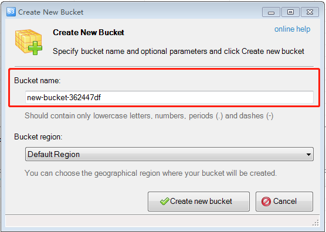
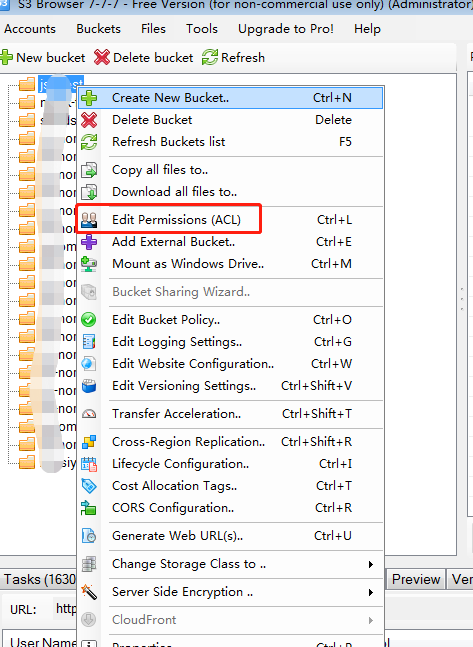
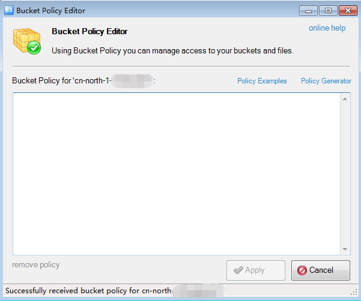
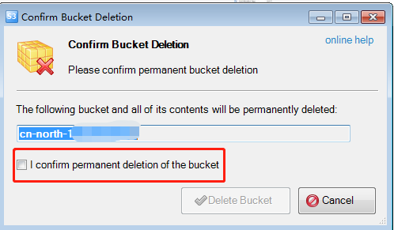
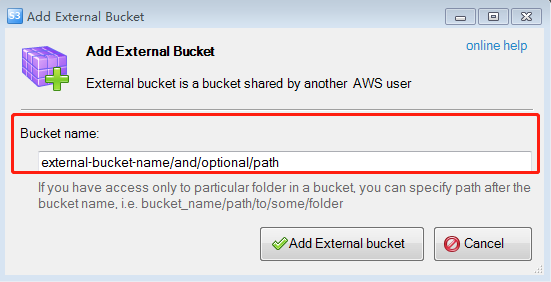
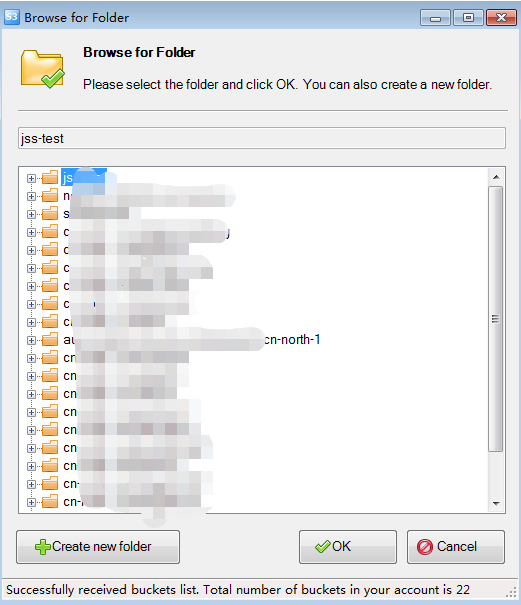

# 使用s3browser管理OSS

* 安装：[安装s3browser](Manage-OSS-With-s3browser#user-content-1)
* 使用s3browser接入OSS：[使用s3browser接入OSS-增加用户](Manage-OSS-With-s3browser#user-content-2)
* 存储空间操作：[使用s3browsers管理OSS- 存储空间操作](Manage-OSS-With-s3browser#user-content-3)
* 创建存储空间（bucket）：[存储空间操作-创建存储空间（bucket）](Manage-OSS-With-s3browser#user-content-3)
* 设置存储空间的Acl：[ 存储空间操作-设置存储空间的Acl](Manage-OSS-With-s3browser#user-content-4)
* 设置Bucket policy：[ 存储空间操作-设置Bucket policy](Manage-OSS-With-s3browser#user-content-5)
* 删除存储空间：[存储空间操作-删除存储空间](Manage-OSS-With-s3browser#user-content-6)
* 添加具有权限的存储空间或文件路径：[存储空间操作-添加具有权限的存储空间或文件路径](Manage-OSS-With-s3browser#user-content-7)
* 列出所有对象：[对象操作-列出所有对象](Manage-OSS-With-s3browser#user-content-8)
* 上传对象：[对象操作-上传对象](Manage-OSS-With-s3browser#user-content-9
* 下载对象：[对象操作-下载对象](Manage-OSS-With-s3browser#user-content-10)
* 复制对象到OSS存储空间：[对象操作-复制对象到OSS存储空间](Manage-OSS-With-s3browser#user-content-11)
* 重命名对象：[对象操作-重命名对象](Manage-OSS-With-s3browser#user-content-12)
* 移动对象：[对象操作-移动对象](Manage-OSS-With-s3browser#user-content-12)
* 删除对象：[对象操作-删除对象](Manage-OSS-With-s3browser#user-content-13)

s3browsers是一种易于使用的Amazon S3免费客户端。它提供了一个简单的服务Web服务接口，可以使用绝大部分的对存储空间（bucket）、对象(object)进行操作管理的功能。

## 安装

1.下载安装包

下载地址：https://s3browser.com/download.aspx

2.安装

点开安装即可

## 使用s3browser接入OSS
###  增加用户

#### 步骤 1 在左侧的 account 下拉菜单中点击【add new account】

#### 步骤 2 在弹出的对话框中，填写相应参数：

*  Account Name：显示名称，一般填自己的用户名即可；
*  Account Type: S3 Compatible Storage；
* REST Endpoint ,填写京东云[兼容S3的服务域名](https://docs.jdcloud.com/cn/object-storage-service/regions-and-endpoints)；
* Signature Version: 选择Version 4；
* Access Key ID: 京东云的AK；
* Secret Access Key: 京东云的SK；
* 是否使用HTTPS: OSS支持http和https,为了您的数据更加安全建议默认勾选，使用https。

## 使用s3browsers管理OSS

### 存储空间操作

#### 创建存储空间（bucket）

1.点击【New bucket】创建存储空间

2.创建弹框中输入bucket name

**说明**
* 存储空间名称全局唯一，如果该名称已经被其他用户占用，将不能创建成功，请您根据[OSS命名规范](https://docs.jdcloud.com/cn/object-storage-service/put-bucket-2)，输入恰当的能够标识自身业务的名称。
* 存储空间创建时默认ACL 为私有读写，您可以根据自己的需求，在创建后更改空间访问权限。参见【设置存储空间的Acl】与【设置Bucket policy】

#### 设置存储空间的Acl

##### 操作步骤
1.在存储空间列表中，选中需要设置的bucket名称，单击右键，选择【edit Permissions(ACL)】。如图：

2.按照OSS支持的规则设置，完成设置。

##### 仅支持设置规则：

* 私有读写，对应设置如图：

* 公有读私有写，对应设置如图：

* 公共读写，对应设置如图：

* 如果您想实现精细化授权给其他用户，可利京东云IAM ，通过京东云控制台可完成设置，如果想仅需为其他京东云账号(包括主账号与子账号)授权OSS 资源的权限，并实现细粒度的灵活授权请参考【设置Bucket policy】

**说明**
设置Bucket ACL时，建议您通过OSS控制台或者SDK设置，相比使用s3browsers更加便捷高效。
同时您需要注意，目前对于OSS而言Bucket ACL 与Bucket policy 仅可通过其一管理存储空间权限，二者不可共存。如同时设置，s3browsers将出现报错并显示异常。

#### 设置Bucket policy

1.在存储空间列表中，选中需要设置的bucket名称，单击右键，选择【edit Bucket policy】。如图：

2.参考[Bucket policy 规范](https://docs.jdcloud.com/cn/object-storage-service/access-control-base-on-bucket-policy),在如下表格中完成设置。

#### 删除存储空间

**说明：**
OSS 存储空间的删除目前必须满足以下条件：

* 存储空间内为空，即无任何文件，包括没有未完成的complete 的分片。
* 存储空间未开启跨区域复制，即不是跨区域复制中的目标存储空间或源存储空间
* 存储空间内没有图片样式。

满足以上条件您可以执行删除存储空间，否则将失败。

##### 操作步骤

1.在存储空间列表中，选中需要设置的bucket名称，单击右键，选择【delete policy】。

2.点击下图中确定删除复选框，即可完成删除，如图：

#### 添加具有权限的存储空间或文件路径

**说明**
##### 应用场景：
当您被授予某个存储空间或某前缀文件的读取权限时，您可以通过添加 external bucekt 的方式实现在s3browser中管理文件与存储空间。
##### 操作步骤

1.使用您的账号登录s3browser后，在菜单栏中点击【Buckets】,下拉框中选择【Add External Buckets】。

2.【Add External Buckets】弹框中添加文件路径，支持添加bucket 或 bucket中某文件夹，保存选项，如图：

### 对象操作

#### 列出所有对象

单击对应的存储空间名即可。

如图：您可以创建文件夹，上传，下载，删除文件等。

#### 上传对象

点击上图中，【Upload】选项,支持文件与文件夹上传。上传完成后自动刷新文件列表。

#### 下载对象

* 方法一：选中需要下载的文件或者文件夹，点击上图中的【Download】选项，选择存储路径完成下载。
* 方法二：选中需要下载的文件或者文件夹，在弹出菜单中选择【Download】

如下图：

#### 复制对象到OSS存储空间

#####  操作步骤
1.右击需要复制的对象，支持文件与文件夹复制
2.点击【Copy to】

3.选择目的存储空间，然后点击OK即可。

#### 重命名对象

1.右击对象

2.选择【Rename】 ，重命名弹框中输入名字，点击【Rename】即可。

#### 移动对象

**说明**
此操作会将原来的对象删除。
#####  操作步骤
1.右击对象

2.选择【Move to 】

3.选择目的存储空间，点击OK即可。

#### 删除对象

支持文件与文件夹删除。
#####  操作步骤

* 方式1：点击对象，右击，点击【Delete】

* 方式2：点击对象，点击对象框下面的【Delete】

