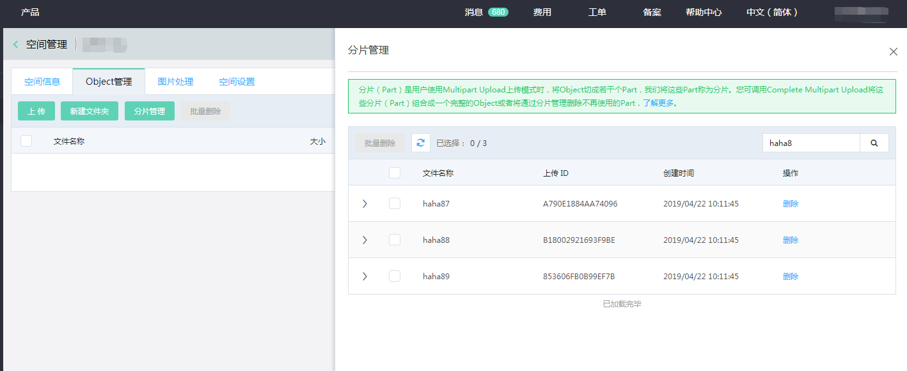

# 分片管理

进行分片上传时，文件（Object）会被切成若干个Part，这些Part被称为分片。当您将这些Part上传到OSS服务端后，可以调用CompleteMultipartUpload将这些片（Part）组合成一个完整的Object。

**说明**
* 使用控制台上传文件时，会产生Part。
* 使用支持断点续传的OSS管理工具传输文件时，也会产生Part。
* 您也可通过直接调用API 实现分片上传，请参见[分片上传](https://docs.jdcloud.com/cn/object-storage-service/initiate-multipart-upload-2)
* 您也可以通过调用CompleteMultipartUpload，将Part组合成一个完整的Object。详见[CompleteMultipartUpload](https://docs.jdcloud.com/cn/object-storage-service/complete-multipart-upload-2)。
* Part在完成Object前，不能被读取。删除Bucket时，必须先将该Bucket中的Object和Part删除。分片主要是由分片上传操作产生，您可通过直接调用[Abort Multipart Upload](https://docs.jdcloud.com/cn/object-storage-service/abort-multipart-upload-2)。
删除未完成的Part，也可通过控制台分片管理完成删除。

## 控制台-分片管理

### 操作步骤

1. 进入[OSS管理控制台](https://oss-console.jdcloud.com/space)。

2.在左侧存储空间列表中，单击目标存储空间名称，打开该存储空间概览页面。

3.单击【Object管理】页签。

4.单击【分片管理】，打开分片管理页面。

 

5.选中未完成的分片文件，点击【删除】或者【批量删除】，完成删除。

**说明**
* 如果要删除该存储空间所有的分片文件，可以点击加载更多将全部的分片任务列出，然后点击全选，之后批量删除。
* 如果要删除部分分片文件，可以逐一选择或通过搜索出指定文件名前缀的分片文件，然后批量删除。

6.在弹出的删除确认对话框中，单击【确定】。

### 您可查看每个分片上传任务中分片详情

1.点击折叠按钮，展示分片上传任务中分片详情。如图：

