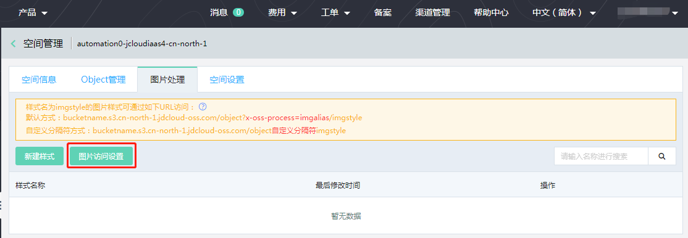

# 自定义分隔符

# 图片样式 

所有对图片的变换操作参数都会加在URL后面，这样会导致图片URL变得冗长，不方便阅读。京东云OSS的图片处理服务提供图片样式功能，您可以将常用的图片操作保存成一个别名，即图片样式（IMGStyle）。一个复杂操作，利用图片样式功能后，只要一个很短的URL就能实现相同的效果。

**一个Bucket下有多个样式，样式的作用范围只在一个Bucket下。**

##  图片样式访问规则 

*  **URL参数方式访问**

            ```
            <文件URL>?x-oss-process=imgalias/<StyleName>

            ```

    示例：
    ```
    bucket.s3.cn-north-1.jdcloud-oss.com/lena.jpg?x-oss-process=imgalias/stylename
    
    ```

    **这种方式是图片处理默认支持的样式访问方式,您字只需求通过控制台完成新建图片样式的操作即可使用**

* **分隔符方式访问**

        ```
        <文件URL><分隔符><StyleName>

        ```

    示例：
   
         bucket.s3.cn-north-1.jdcloud-oss.com/lena.jpg{分隔符}stylename 

    当图片的URL带了分隔符，OSS图片处理服务会把该分隔符后面的内容当成样式的名称。分隔符只有在控制台配置成功后才能生效，支持
        
         -、_、/、!
       
        
   样式分隔符。分隔符方式访问为图片处理可选的使用方式。

**说明**

    *  StyleName是图片样式的名称。
    *   创建样式、删除样式和修改样式可在控制台操作也可通过OPENAPI操作。
    *   访问的图片样式必须为图片文件所在的bucket中，否则将报错。
  

## 设置分隔符 

1.  在[OSS控制台](https://oss-console.jdcloud.com/space)左侧存储空间列表中，单击您要向其设置分隔符的存储空间名称。

2.  单击**图片处理**页签，找到**图片访问设置**按钮。

    

3.  单击**图片访问设置**，打开设置窗口。

    

    在设置窗口中您可以进行以下设置：

    -   原图保护
    
        开启原图保护后，您需要了解的信息请参见[图片原图保护-原图保护规则](https://docs.jdcloud.com/cn/object-storage-service/source-image-protection)。

        
    -   自定义分隔符。
        * 你可以选择一个或者多个分隔符
        * 分隔符与原图保护设置可分别设置。
        
        
4.设置好您需要的选项之后单击**确定**完成分隔符的设置。


## 示例

假如对downloads这个bucket创建一个样式：


-   直接参数访问

    [https://downloads.s3.cn-north-1.jcloudcs.com/lena.jpg?x-oss-process=img/r/60/q/71/p/s/200/300](https://downloads.s3.cn-north-1.jcloudcs.com/lena.jpg?x-oss-process=img/s/200/300/cc/200/260)

    

-   通过URL参数，使用样式访问

    [https://downloads.s3.cn-north-1.jdcloud-oss.com/lena.jpg?x-oss-process=imgalias/imgstyle_demo](http://image-demo.oss-cn-hangzhou.aliyuncs.com/example.jpg?x-oss-process=style/panda_style)

    

-   通过样式分隔符，使用样式方式访问

    [https://downloads.s3.cn-north-1.jdcloud-oss.com/lena.jpg?!imgstyle_demo](https://downloads.s3.cn-north-1.jcloudcs.com/lena.jpg?!imgstyle_demo)

    


三者可以达到同样的效果。


