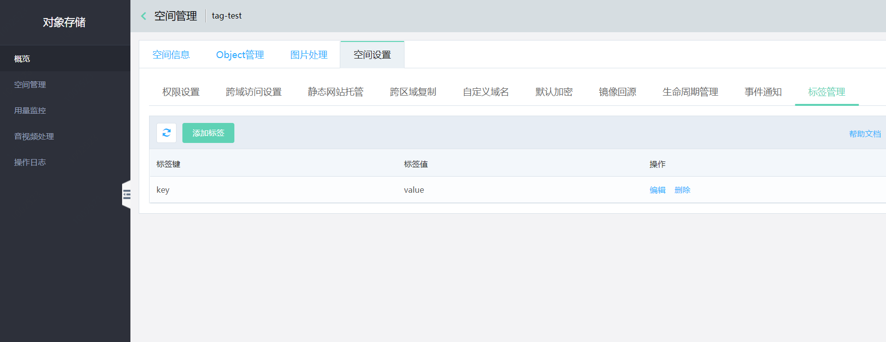

# Bucket标签管理

## 标签简介

存储桶标签是一个键值对，用于标识OSS中的存储桶。它可以作为管理存储桶的一个标识，便于用户对存储桶进行分组管理。

规则说明：
- 一个Bucket最多设置50个标签；
- 标签键：区分大小写，最多128个Unicode字符，不允许为空；
- 标签值：区分大小写，最多256个Unicode字符；
- 存储桶标签集中的标签键是唯一的。

## 设置标签

对象存储支持通过控制台添加标签，设置步骤请参考如下内容。如需使用API设置标签，请参考[Put Bucket tagging](../../API-Reference-S3-Compatible/Compatibility-API/Operations-On-Bucket/Put-Bucket-Tagging.md)。

1.登入控制台->对象存储->空间管理->进入某个Bucket->空间设置->标签管理，在该页面下您可以查看当前Bucket的标签，也可以新增标签和删除标签。

2.点击“添加标签”，可进入添加标签页面。

