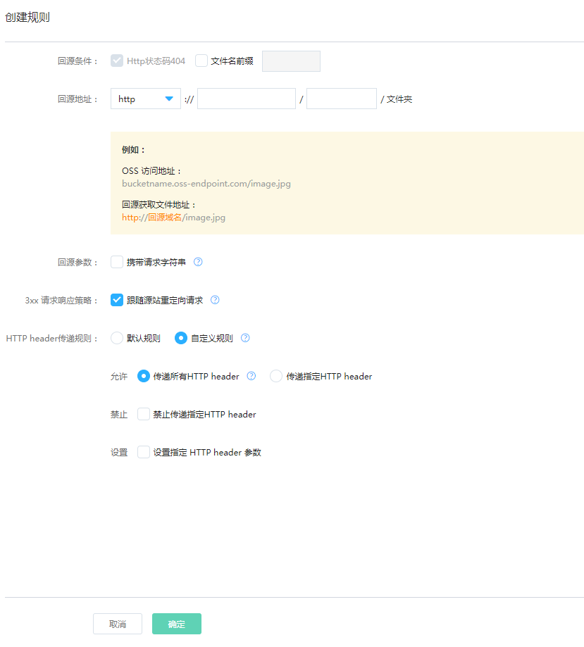

#  镜像回源设置

通过回源设置，对于获取数据的请求通过镜像方式进行回源读取，满足您对于数据热迁移需求。

您配置镜像回源规则后，对每条到OSS的Get请求的URL进行匹配，然后按照您设定的规则进行回源。最多配置5条规则，按照顺序匹配，
直到匹配到有效规则。

## 镜像回源


如果配置了镜像回写，则对一个不存在的文件进行Get操作时，OSS会向源地址请求这个文件，返回给用户，并同时写入到OSS。

## 使用场景  
镜像回源主要用于无缝迁移数据到京东云OSS，即服务已经在自己建立的源站或者在其他云产品上运行，需要迁移到京东云OSS上，但是又不能停止服务，此时可利用镜像回写功能实现。具体场景分析如下：

源站有一批冷数据，同时在不断的生成新的热数据。

可以先通过迁移工具将冷数据迁移到OSS上，同时配置镜像回源，将源站的地址配置到OSS上。当将域名切换到京东云OSS上（或者京东云的CDN，回源到OSS）之后，就算有一部分新生成的数据没有迁移过来，依然可以在OSS上正常访问到，且访问一次后文件就会存入到OSS。域名切换后，源站已经没有新的数据产生了，此时再扫描一次，将还没有导过来的数据一次性导入到OSS，然后将镜像回写配置删除。

如果配置的回源是IP地址，那么将域名迁移到OSS后还可以继续镜像到源站，但是如果配置的是一个域名，由于域名本身会解析到OSS或者CDN，那么镜像就失去作用了，在这种情况下，可以另外申请一个域名作为镜像的源站，这个域名与正在服务的域名解析到同一个IP地址，这样服务域名迁移的时候就可以继续镜像到源站了。

只切换源站的部分流量到OSS或者CDN，源站本身还在不断的产生数据。

迁移方式与上述方式类似，只是流量切换到OSS后，不要将镜像回源配置删掉，这样可以保证切换到OSS或者CDN的流量还是能够取到源站的数据。

细节分析

* 有当GetObject()本应该返回404的情况下，OSS才会执行镜像回源，向源站请求文件，保存在OSS上。
* 源站请求的URL为MirrorURL+object，回写到OSS的文件名为“object”，例如bucket为example-bucket，配置了镜像回写，MirrorURL为http://www.example-domain.com/ ，文件image/example_object.jpg不在这个bucket里面，此时去下载这个文件时，OSS将向http://www.example-domain.com/image/example_object.jpg 发起GET请求，并将结果同时返回给用户以及写入到OSS，当下载完成后，这个文件就已经存在OSS上了，文件名为image/example_object.jpg，此时相当于将源站的文件同名的迁移到了OSS上。如果MirrorURL带有path信息，比如http://www.example-domain.com/dir1/ ，则与上例相同，OSS回源的URL为http://www.example-domain.com/dir1/image/example_object.jpg ，写入到OSS的object依然是image/example_object.jpg，此时相当于将源站的某一个目录下的文件迁移到OSS上。
* 给OSS的header信息默认是不会传递给源站。但是支持用户根据实际业务指定header。
* querystring信息是否会传递给源站取决于用户的配置。
* 如果源站是chunked编码返回，那么OSS返回给用户的也是chunked编码。
* 如果从源站读取的文件将在OSS按照标准存储类型存储。
* OSS会将源站的以下头信息返回并存为OSS的头信息：

 ``` 
Content-Type
Content-Encoding
Content-Disposition
Cache-Control
Expires
```

* 假设文件已经通过镜像方式回写到了OSS，如果源站的相同文件发生了变化，那OSS不会更新已经存在于OSS上的文件，因为此时文件已经在OSS上，不符合镜像回写的条件。
* 如果镜像源站也无此文件，即镜像源返回给OSS的http status为404，那么OSS也返回404给用户，如果是其他非200的状态码（包括因为网络原因等获取不到文件的错误情况），OSS将返回424给用户，错误码为“MirrorFailed”。


## 镜像回源规则设置 

### 使用OSS管理控制台，设置镜像回源。

1.登入控制台->对象存储->空间管理->进入某个Bucket->空间设置->镜像回源


2.点击设置规则，进入镜像回源规则列表页。


3. 单击创建规则，在创建弹框中设置回源条件和回源地址。还可以根据实际需要选择设置是否携带请求字符串；设置3xx 请求响应是否跟随源站重定向请求
   同时支持通过设置HTTP header传递规则，进行自定义透传、过滤或者修改。
                           
   说明：
    - 镜像回源将按照外网流量正常收费。
    - 回源地址为必填项，支持域名与IP，支持端口。
    - 携带请求字符串，会将 OSS 请求中的 queryString 传递到源站
    - 3xx 请求响应设置默认会跟随源站重定向请求获取到资源，并将资源保存到 OSS 上。若不勾选，OSS会透传 3XX 响应，不获取资源。
    - HTTP header传递规则:
      默认传给OSS的header信息不会传递给源站
      自定义规则允许您指定允许、禁止、设置指定header参数，
  配置举例如下：
  
    根据以上配置，如果用户发送到OSS的请求（HTTP header部分）如下：
    ```
    GET /object
    host : bucket.s3.cn-north-1.jcloudcs.com
    a-header : 111
    b-header : 222
    c-header : 333
    ```
    则触发镜像回源后，OSS发送给源站的请求如下：
    ```
    GET /object
    host : source.com
    a-header : 111
    c-header : 000
    ```
    说明：
    
        1.传递所有 HTTP header会将所有header透传过去，
         包括host头（一般是bucketname.endpoint，如bucketname.s3.cn-north-1.jcloudcs.com），
         由于大部分源站会对host头做校验，可能导致源站无法识别请求，所以您要慎重勾选。如果您确定要透传所有 header，
         请尽量在[禁止传递指定 HTTP header]中配置禁止传递host头和其他可能会影响源站识别的header。
         
        2. 以下HTTP header类型不支持设置HTTP header传递规则：
             - 以下前缀开头的header：
                 - x-oss-
             - 所有标准HTTP header，例如：
                 - authorization2
                 - authorization
                 - content-length
                 - range
                 - date
                 
8.  单击确定,提交规则。

### 规则保存成功后，您可以在镜像回源规则列表中查看已设置的回源规则，并进行编辑、删除或是排序等操作。

1.登入控制台->对象存储->空间管理->进入某个Bucket->空间设置->镜像回源


