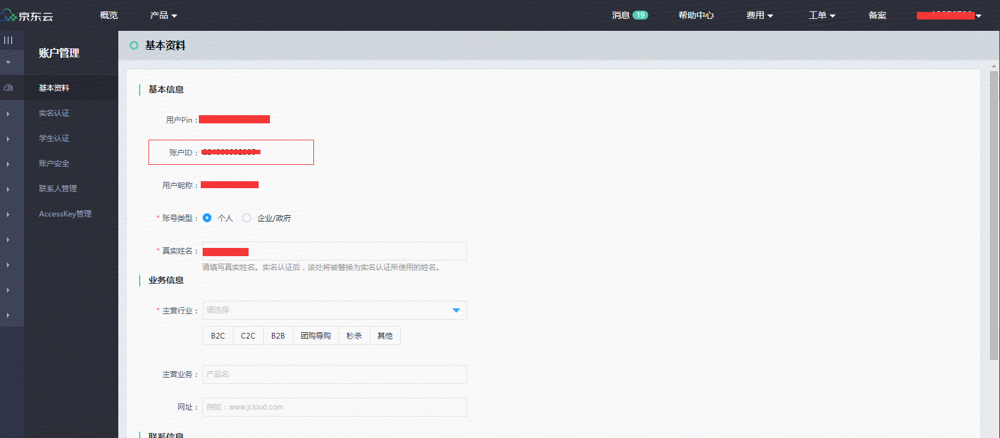
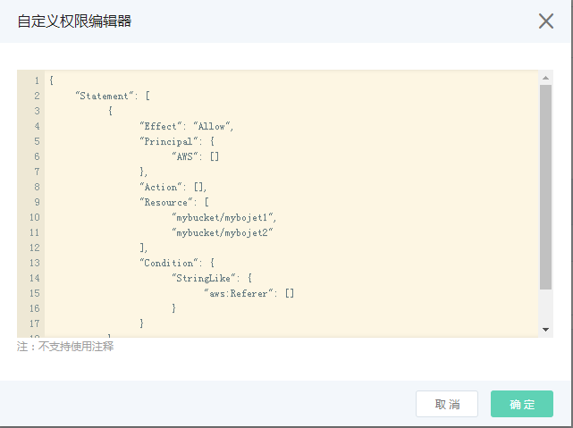
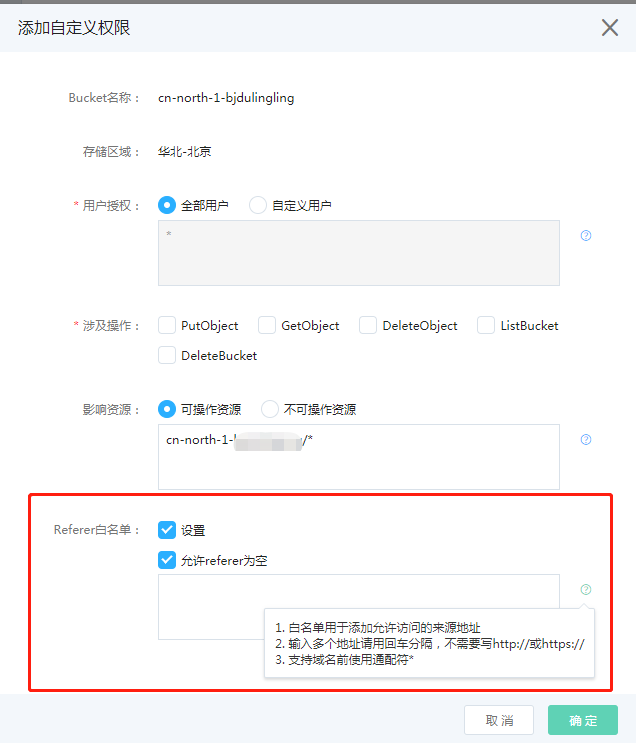

# 访问控制权限设置

京东云对象存储提供灵活权限控制机制，您可以在创建存储空间的时候设置存储空间的访问权限，也可以在创建之后修改空间权限，除了提供存储空间级别的访问权限控制，您也可以对文件和目录级别进行灵活的权限访问配置。目前针对Bucket级有四种访问权限：

|权限名称|权限英文值|权限说明|
|-|-|-|
|私有读写|Private|Bucket Owner获得全部可执行的操作权限，只有该Bucket的Owner可以对存放在其中的Object进行读/写/删除操作；其他人没有任何权限，在未经授权的情况下无法访问该Bucket内的Object|
|公有读私有写|Public-Read|Bucket Owner获得全部可执行的操作权限，只有该Bucket的Owner可以对存放在其中的Object进行写/删除操作；其他人（包括匿名访问）可以对Object进行读操作。|
|公有读写|Public-Read-Write|Bucket Owner获得全部可执行的操作权限，其他人获得READ和WRITE权限；所有这些操作产生的费用由该Bucket的Owner承担，请慎用该权限。|
自定义权限|User-Defined|可对指定用户设置GetObject、PutObject、DeleteObject、ListObjects、DeleteBucket的权限，并可指定该权限可访问的资源，以及指定具有该权限的IP地址和Referer白名单等.|

细节说明：
若您是通过API或SDK创建的Bucket，并且在创建时并未指定Bucket的权限，则系统会为该Bucket赋予默认的私有读写（Private）权限，您可根据自身业务情况修改存储空间权限。

### 控制台中操作步骤

1.登录京东云控制台，选择对象存储->空间管理->空间设置，选择**权限设置**，展示您当前的权限设置内容，如图：

2.修改空间权限 ，如图：
 
 **说明：**
 
 * 若修改ACL，则点击读写权限设置下拉框，选择私有读写、公有读私有写、公有读写3中权限，点击确定。

 * 若想实现对Bucket细粒度的权限管理，请使用Bucket policy,在读写权限设置处，点击自定义权限，即可完成Bucket policy设置。设置页面如下图：
 
 支持权限表单设置和编辑器两种方式：
 - 【添加自定义权限】--您可以使用方便简单的表单，填写设置项完成设置。
   
      - （1）每个Bucket最多允许创建10个Bucket Policy；
      - （2）Bucket Policy中各个字段的定义如下：
         a. 用户授权：定义了该Bucket Policy所影响到的用户，默认值为 “*”， 语义是对全部用户生效，若需要只针对部分用户生效，请点击“自定义用户”，并在文本框中 输入对应用户的用户ID指定用户时，您无需输入前缀“arn:aws:iam::”，按照如下方式输入：
         1.主账号：AccountID
         2.子账号 AccountID：user/username。每行一个用户ID，即通过换行符间隔多个AccountID
         （注：您的AccountID可以到用户管理中去查询，效果如下图）。
         
        

        

        b. 涉及操作：定义了对该Bucket可以进行的操作，可进行单选也可进行全选，但至少要勾选一项，每项操作定义如下：

        |操作项名称|操作项说明|
        |-|-|
        |PutObject|上传某个Object到该Bucket，支持普通上传和分块上传|
        |GetObject|获取该Bucket内某个Object及其相关信息|
        |DeleteObject|删除该Bucket内某个Object|
        |ListBucket|列出该Bucket内的Objcet|
        |DeleteBucket|删除该Bucket|

        c. 影响资源：定义了对该Bucket下的哪些资源可操作或不可操作（即Allow或Deny），默认选中“可操作资源”，文本框中默认值为bucketname/*，语义为对当前Bucket下的全部资源是可操作的，输入格式示例：myBucket/myfolder/object* ，myBucket/*，内容必须以Bucket名称开始，资源如果只有1个斜杠，不能以斜杠结尾，资源可以设置多个，每行1个且每行最多1个通配符，最多可以增加10条记录。

        d. Referer白名单：由于京东云对象存储是按用量收费，为避免您存储在京东云对象存储的数据被其他人盗链，京东云对象存储支持基于HTTP Header中表头字段的Referer防盗链方法，您可以在对象存储控制台的自定义权限中或者通过API的方式对一个Bucket设置Referer字段的白名单和是否允许Referer为空的请求访问，下文会对Referer白名单的规则作出详解。
 - 【添加自定义编辑器】--您可以可视化编辑器，直接填写JSON指定合法的Bucket policy。
  
  
   **细节说明**
     - 编辑器中无法添加注释，且最多允许输入16KB。
     - 您输入的Bucket policy 必须为合法JSON。

## 设置Referer白名单

为了防止存储在对象存储中的数据被其他人盗链，京东云对象存储支持基于HTTP Header Referer字段的防盗链方法。可通过控制台设置Referer字段的白名单。设置白名单后，只有Referer字段在白名单内的用户才可访问Bucket中存储的数据，不在白名单内的请求会被拒绝。但若未配置Referer白名单时，默认可访问，不受白名单限制。

使用规则如下：

* Referer防盗链规则只对Bucket权限为“自定义权限”的Bucket生效，默认规则为“允许Referer为空、白名单为空”；

* 空Referer的定义为：一个HTTP请求中不包含Referer头部或Referer头部的内容为空；

* Referer白名单支持域名或IP地址（若无域名，必须将IP加入白名单中），可以设置多个，使用换行符（回车）来分隔，不区分大小写，域名前不需要写 http:// 或https:// ；

* 防盗链输入内容最多可输 500 条或总字节数不超过16384字节（即16KB）；

* 防盗链Referer域名或IP参数支持使用通配符“*”，在域名前缀使用通配符如*.test.com可用于指代所有test.com下的多级子域名，域名支持http和https协议；

* IP地址：指定拥有该权限的IP地址列表，使用CIDR方式对IP进行标识，每个IP最多1个通配符*，并且以.*结尾。示例：192.168.0.1/24，192.168.0.100，192.168.* 或192.168.1.*；

Referer白名单语义解释：

* 当用户设置允许Referer为空，且白名单内为空时，则Referer为空的请求会被允许，其他请求（Referer不为空）都会被拒绝；

* 当用户设置允许Referer为空，且白名单内不为空时，则Referer为空的请求和符合白名单的请求会被允许，其他请求都会被拒绝；

* 当用户设置不允许Referer为空，且白名单内为空时，则无论Referer是否为空，全部请求都被拒绝；

* 当用户设置不允许Referer为空，且白名单内不为空时，则只有Referer属于白名单的请求被允许，其他请求（包括Referer为空的请求）会被拒绝。

参考效果如下：

 
 
 

 
 
 
 

