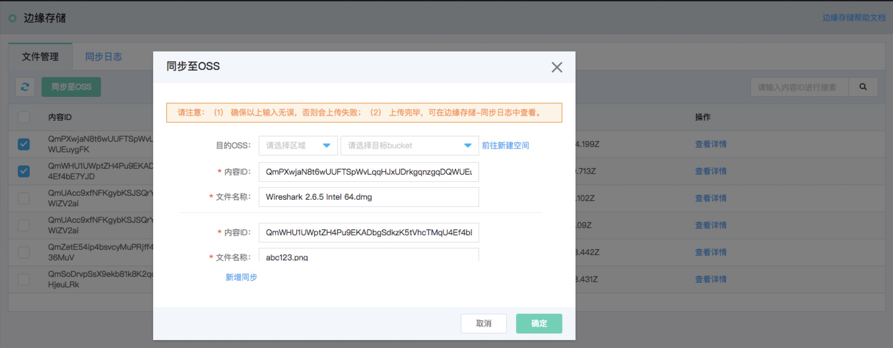
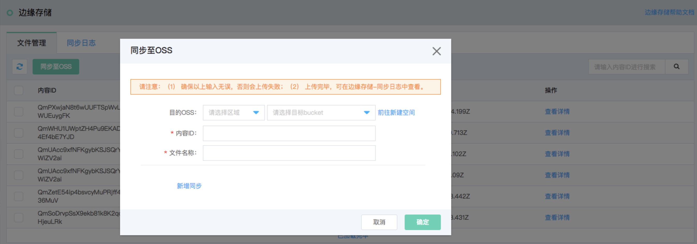
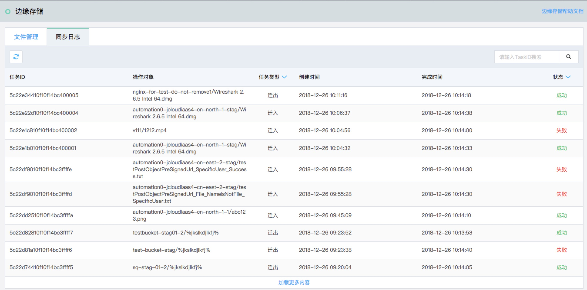

# 边缘存储

边缘存储（Edge Storage）底层利用IPFS（星际文件系统）搭建的系统，拥有如下特性：

1.天然支持跨区复制，提高数据可靠性。

2.灵活的副本策略，赋予用户可靠性和成本之间的平衡。

3.天然的P2P网络分发特性，节约用户带宽成本。

## 使用场景

当您有以下需要时，设置边缘存储可能对您有所帮助： 

* 监控视频存储：城市交通，学校，政府，工业园区，商业楼宇，智能住宅，酒店等有监控需求的场所。以上场景共性是分布着大量的监控设备，由于本地存储受限，无法满足视频数据量日益增大的场景。

* 物联网边缘存储：物联网的边缘设备增多，边缘节点的存储需求也增大。作为离线存储的应用场景，在边缘节点上部署存储服务，将数据加速存储在边缘节点中，并终将数据持久化到保存用户的数据中心或云端。

* 数据存储和备份：应用于日志文件，图片，音视频，静态网站托管，备份和归档，私有云存储等场景。同时应用于本地数据备份，跨云厂商数据备份等场景。

* 互联网信息安全：近年来，国内社会发生过多次因黑客入侵而导致的规模用户信息泄漏事件，都对用户造成了很大的损失和影响，如果采用的去中心化的存储架构，所有数据访问都分布在不同的节点，想要入侵就要攻击所有节点，从而有效地保证了数据的安全，保护了用户的隐私。

* 区块链应用：作为链下数据存储的底层支撑。


## 在控制台中操作过程如下：


1.开启“边缘存储”服务

1）登入控制台->对象存储->空间管理->进入某个Bucket->空间设置->边缘存储


2）确认无误后，点击“开启”按钮。


备注：确认“边缘存储”服务是已经开启的状态，才能在进行以下操作。

2.OSS同步至边缘存储

1）登入控制台->对象存储->空间管理->进入某个Bucket->Object管理


2）选择单个文件或批量文件同步。


3）单击“同步至边缘存储”或“批量同步至边缘存储”按钮，显示所选的文件及同步详情。


4）单击“确定”按钮，页面右上出现任务数量及查看详情。

3.边缘存储同步至OSS。

1）登入控制台->对象存储->边缘存储->文件管理


2）选择单个文件或批量文件同步。



若用户有自己的IPFS节点，希望将自己的文件存储到OSS中；此时不需要选择任何文件，直接点击“同步至OSS”按钮，填写下图信息即可。



3）查看同步日志




## API统一信息

- 服务域名：apigw-internal.cn-north-1.jcloudcs.com
- 认证: [JD API 网关](https://www.jdcloud.com/cn/products/api-gateway) 统一认证

## API 详情

### 1.同步至边缘存储

POST /v1/regions/{region}/tasks HTTP/1.1

#### 请求头：

```
x-jdcloud-request-id: "97eef699115c2d3ab60c5c5055d5a989",
x-jdcloud-pin: "userPin"
x-jdcloud-userId: "526595513548"
migrationType: 1
```

#### 请求 body:

```
{
  "group": "pictures",
  "ossRegion": "cn-north-1",
  "ossBucket": "pictures",
  "items": [
    {
      "objectKey": "son/cute.jpg",
      "ossKey": "son/cute.jp"
    },
    {
      "objectKey": "wife/pretty.jpg",
      "ossKey": "wife/pretty.jpg"
    }
  ]
}
```

#### 请求响应：

HTTP/1.1 200 OK 

```json
{
  "requestId": "xxxx",
  "result": {
    "taskIds": [
      "taskId1-xxx",
      "taskId2-xxx"
    ]
  }
}
```

#### 字段说明：

- 输入参数：

|参数|类型|是否必须 |描述|
|---|---|---|---|
|x-jdcloud-pin|string|是|位于请求头，用户pin，base64编码: OpenAPI|
|x-jdcloud-userId|string|是|位于请求头，用户的Id|
|x-jdcloud-request-id|string|是|位于请求头，位于请求头信息。Gateway生成，后端服务日志需要打印输出，用于关联请求处理链条|
|migrationType|int|是|位于请求头，迁移类型，此处为 1 迁入IPFS|
|group|string|是|位于请求 Body，IPFS存储服务的资源组，默认值为ossBucket|
|ossRegion|string|是|位于请求 Body，OSS所在区域|
|ossBucket|string|是|位于请求 Body，OSS的 ossBucket|
|items|MigrationItem[]|是|	位于请求 Body，具体迁移的文件|

- MigrationItem：

|参数|类型|是否必须 |描述|
|---|---|---|---|
|objectKey|string|是|在 IPFS 中的文件名|
|ossKey|string|是|OSS的文件名|

- 返回值：

|参数|类型 |描述|
|---|---|---|
|requestId|	string|	用于记录日志和排错等|
|taskIds| []string|	任务 taskId 数组|

### 2.边缘存储同步至OSS

POST /v1/regions/{region}/tasks HTTP/1.1

#### 请求头：

```
x-jdcloud-request-id: "97eef699115c2d3ab60c5c5055d5a989",
x-jdcloud-pin: "userPin"
x-jdcloud-userId: "526595513548"
migrationType: 2
```

#### 请求 body:

```
{
  "group": "pictures",
  "ossRegion": "cn-north-1",
  "ossBucket": "pictures",
  "items": [
    {
      "objectHash": "Qmxxx",
      "ossKey": "son/cute.jp"
    }
    {
      "objectHash": "Qmxxx",
      "ossKey": "wife/pretty.jpg"
    }
  ]
}
```

#### 请求响应：

HTTP/1.1 200 OK 

```json
{
  "requestId": "xxxx",
  "result": {
    "taskIds": [
    "taskId1-xxx",
    "taskId2-xxx"
    ]
  }
}
```

#### 字段说明：

- 输入参数：

|参数|类型|是否必须 |描述|
|---|---|---|---|
|x-jdcloud-pin|string|是|位于请求头，用户pin，base64编码: OpenAPI|
|x-jdcloud-userId|string|是|位于请求头，用户的Id|
|x-jdcloud-request-id|string|是|位于请求头，位于请求头信息。Gateway生成，后端服务日志需要打印输出，用于关联请求处理链条|
|migrationType|int|是|位于请求头，迁移类型，此处为 2 迁入对象存储|
|group|string|是|位于请求 Body，IPFS存储服务的资源组，默认值为ossBucket|
|ossRegion|string|是|位于请求 Body，OSS所在区域|
|ossBucket|string|是|位于请求 Body，OSS的 ossBucket|
|items|MigrationItem[]|是|	位于请求 Body，具体迁移的文件|

- MigrationItem：

|参数|类型|是否必须 |描述|
|---|---|---|---|
|objectHash|string|是|IPFS 中的内容id|
|ossKey|string|是|OSS的文件名|

- 返回值：

|参数|类型 |描述|
|---|---|---|
|requestId|	string|	用于记录日志和排错等|
|taskIds| []string|	任务 taskId 数组|

### 3.查看文件管理

GET /v1/regions/{region}/files?total=100&marker=xxx&filter=<CID> HTTP/1.1

#### 请求头:

```
x-jdcloud-request-id: "97eef699115c2d3ab60c5c5055d5a989",
x-jdcloud-pin: "henry",
```

#### 请求响应：

```
{
   "requestId": "xxxx",
   "result": {
        "fileInfos": [
            {
                "id": "xxxx"
                "pin": "henry",
                "region": "cn-north-1",
                "group": "pictures",
                "objectKey": "self_in_beijing.jpg",
                "objectCid": "xxxxx",
                "objectSize": 1024,
                "createdTime": "2018-11-29 11:51:52",
                "deleteTime": "2018-11-29 11:51:52",
            },
            {
                "id": "xxxx"
                "pin": "henry",
                "region": "cn-north-1",
                "group": "pictures",
                "objectKey": "child_in_beijing.jpg",
                "objectCid": "xxxxx",
                "objectSize": 2048,
                "createdTime": "2018-11-28 11:51:52",
                "deleteTime": "2018-11-29 11:51:52",
            },
        ],
         "marker": "child_in_beijing.jpg",
         "totalCount":2
    }
}
```
#### 字段说明：

- 输入参数：

|参数|类型|是否必须 |描述|
|---|---|---|---|
|x-jdcloud-request-id|string|是|位于请求头信息。|
|x-jdcloud-pin|string|是|位于请求头信息。用户pin|
|total|int|否|单次查询返回的最多文件数，默认值100，有效值为：1--1000|
|marker|string|否|表示文件列表的起始位置（marker 一般为上次调用files接口的lastKey），marker 不包含，空代表从头开始|
|filter|string|否|	根据文件 cid IPFS hash 进行搜索，如果 cid 不合法（Qm开头，长度46位），将自动忽略此参数。|

- 输出参数:

|参数|类型|描述|
|---|---|---|
|requestId|string|用于记录日志和排错等|
|totalCount|int|返回FileInfo的数量|
|fileInfos|FileInfo[]|FileInfo类型的数组|
|lastMarker|string|如果有后续文件则返回fileInfos列表中最后一个Id|

- FileInfo:

|参数|类型|描述|
|---|---|---|
|id|string|文件id|
|pin|string|用户pin|
|region|string|文件所在 IPFS cluster的区域：cn-north-1,cn-south-1等|
|group|string|文件所属资源组|
|objectKey|string|文件名|
|objectCid|string|文件cid|
|objectSize|int|文件大小|
|createdTime|string|创建时间，UTC|
|deletedTime|string|预计删除时间，UTC|

### 4.查看同步日志

GET /v1/regions/{region}/tasks?migrationType=1&state=1&marker=xxxxx HTTP/1.1

#### 请求头:

```
x-jdcloud-request-id: "97eef699115c2d3ab60c5c5055d5a989",
x-jdcloud-pin: "userPin"
```

#### 请求响应:

```json
{
    "requestId": "test-request-id",
    "result": {
        "lastMarker": "5c125c558309dcc3e3503522",
        "totalCount": 2,
        "taskInfos": [
            {
                "userId": "808973897732",
                "pin": "oss-test-01",
                "taskId": "5c1345ab8309dc86f7f7fab3",
                "migrationType": 1,
                "state": 4,
                "errorMsg": "NotFound: Not Found\n\tstatus code: 404, request id: , host id: ",
                "group": "test-group",
                "objectKey": "migration-worker-ut-wrong",
                "objectHash": "",
                "ossRegion": "cn-int-1",
                "ossBucket": "epn-int-1",
                "ossKey": "migration-worker-ut-wrong",
                "createdTime": "2018-12-14 05:54:51",
                "finishedTime": "2018-12-14 07:07:34"
            },
            {
                "userId": "808973897732",
                "pin": "oss-test-01",
                "taskId": "5c125c558309dcc3e3503522",
                "migrationType": 1,
                "state": 3,
                "errorMsg": "",
                "group": "epn-int-1",
                "objectKey": "migration-worker-ut3",
                "objectHash": "QmSJT66hcriFyovZxLQWLQHAqahfs7jP4C7D1giFUhwrcV",
                "ossRegion": "cn-int-1",
                "ossBucket": "epn-int-1",
                "ossKey": "migration-worker-ut3",
                "createdTime": "2018-12-14 05:54:51",
                "finishedTime": "2018-12-14 07:07:34"
            }
        ]
    }
}
```

#### 字段说明：

- 输入参数：

|参数|类型|是否必须 |描述|
|---|---|---|---|
|x-jdcloud-pin|string|是|位于请求头, 用户pin，base64编码: OpenAPI|
|x-jdcloud-request-id|string|是|位于请求头, Gateway生成，后端服务日志需要打印输出，用于关联请求处理链条|
|migrationType|int|否|任务类型：1 迁入任务，2 迁出任务，默认值 -1 代表所有|
|state|int|否|状态：1: 新建（还未处理），2:进行中、3:成功、4:失败, 默认为-1 代表所有|
|filter|string|否|filter只支持单个taskId，用于过滤根据taskId进行过滤|
|total|int|否|单次查询返回的最多任务数目，默认值100，有效值为：1--1000|
|marker|string|否|标示任务列表的起始位置（marker 一般为上次调用 tasks 接口的 lastMarker），marker 不包含，空代表从头开始|

- 返回值：

|参数|类型|描述|
|---|---|---|
|requestId|string|用于记录日志和排错等|
|totalCount|int|返回TaskInfo的数量|
|taskInfos|TaskInfo[]|描述task类型的数组|
|lastMarker|string|如果有后续任务则返回taskInfos列表中最后一个taskId|

- TaskInfo：

|参数|类型|描述|
|---|---|---|
|userId|string|用户 id|
|pin|string|用户 pin|
|taskId|string|任务的taskId|
|migrationType|int|任务类型：0迁入任务，1迁出任务|
|state|int|状态：1: 新建（还未处理）、2:进行中、3:成功、4:失败|
|errorMsg|string|错误消息|
|group|string|文件所在IPFS存储服务的文件组|
|objectKey|string|IPFS存储服务中的文件名|
|objectHash|string|IPFS文件的hash值|
|ossRegion|string|OSS所在区域|
|ossBucket|string|OSS的ossBucket|
|ossKey|string|OSS的文件名|
|createdTime|string|任务创建时间 GMT+8,格式为YYYY-MM-DD HH:mm:ss|
|finishedTime|string|任务完成时间 GMT+8,格式为YYYY-MM-DD HH:mm:ss|
