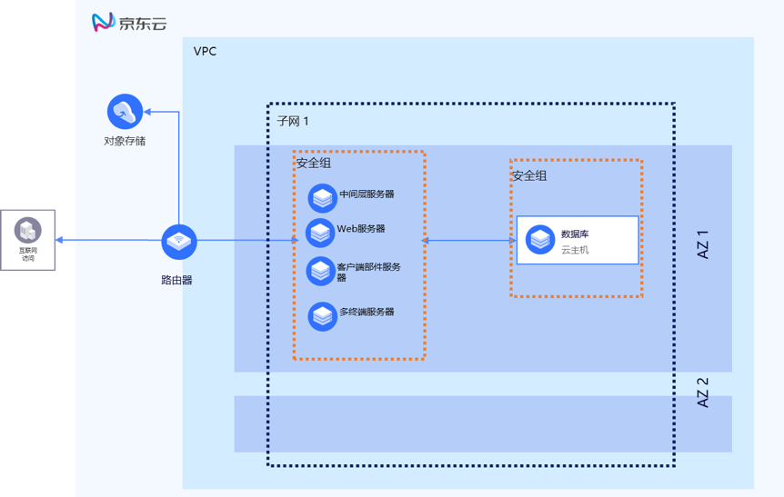
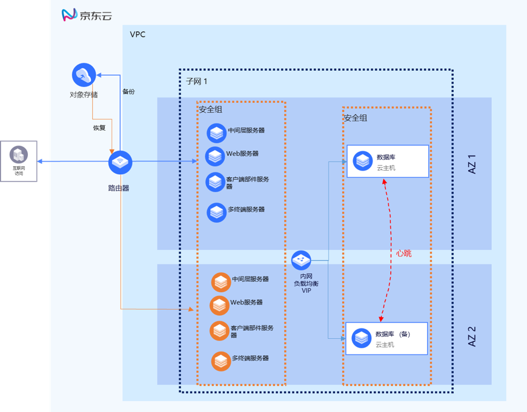
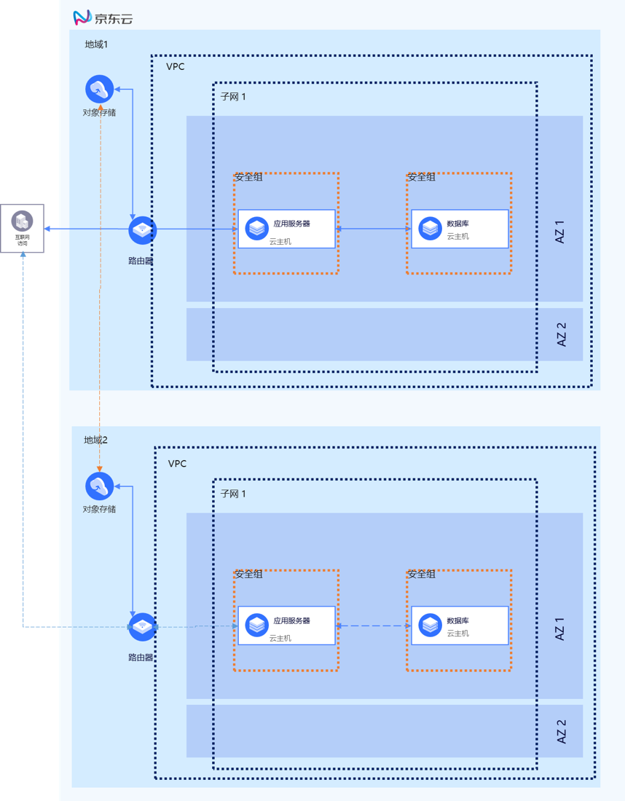

# 金蝶K3WISE在京东云上的最佳实践

下图是一个金蝶K3WISE在京东云上的部署案例，此部署案例中，金蝶K3WISE部署采用分层部署方案，数据库、中间层、Web系统均分别单独部署在专用服务器上，适合于K/3系统大多数部署案例。在小型的应用场合，业务量较小，采用单机部署方案，只有不超过10个并发客户端的情况下，可以将中间层和数据库安装在同一台服务器上。对于更大规模的部署，可以采用扩展部署方案，数据库高可用、应用层群集和WEB能群集方案。

## 网络最佳实践

- 私有网络VPC设计。
VPC是云上的私有网络，为客户的应用提供一个独立的私有网络环境。客户在京东云上部署金蝶K3WISE时，需要规划一个独立的私有网络。与其他客户进行网络隔离。

- 子网设计。
对于金蝶K3WISE的部署，可以建立1个或2个子网，用于金蝶K3WISE的单机部署或分层部署，将应用层服务器放置于一个子网，数据库服务器放置于一个子网。

- 弹性IP设计。弹性IP可以让客户的应用实例和广域网联通，供客户远程访问应用。应用部署到京东云上时，需要为应用申请一个弹性IP。客户现在通过应用虚拟化的客户端访问应用，弹性IP也用于应用虚拟化的server端IP地址，向广域网发布应用。

- 安全组设计。安全组用于云主机实例的安全防护。为了安全起见，安全组应只允许必需的端口访问通过。如使用应用虚拟化产品访问时，可只开通80/443等端口即可。

## 可用性最佳实践

利用京东云的多可用区特性可实现应用的高可用，为了利用多可用区特性实现应用的高可用，需要应用本身能够支撑分布式高可用部署。对于金蝶K3WISE，基于成本及RTO推荐标准方案部署的要求，我们高可用机制可采用如下方案，如下图所示。

- 数据库高可用部署。将部署数据库的云主机分布到不同的AZ，并将其安装的数据库配置成双机热备的高可用方式。数据库前端部署负载均衡，实现数据库访问的负载均衡。

- 将应用服务器分布式部署到1个可用区，并制作应用服务器的镜像，在region级镜像可用。

- 当生产环境部署的可用区出现问题时，可基于镜像在其他可用区创建应用层云主机，恢复业务。

## 可扩展性最佳实践

金蝶K3WISE软件本身为成长型企业打造，支持多种部署方案，单机全量部署或应用与数据库分离部署一般即可满足企业的并发性能要求和扩展性要求，如客户端更多，可采用多应用服务器的部署模式。

- 应用和数据库分离部署。为了应付客户端较多、并发连接较多的情况，可以将应用服务器和数据库服务器分离部署，充分发挥不同角色服务器的性能。

- 多应用服务器部署。当客户端数量超过10个，应该把每个服务器角色分开单独部署，并且建议这些服务器专用于K/3服务，不建议用其他企业应用服务器(例如AD、DNS、Mail等)兼任。这样才不至于多种服务争抢服务器运算资源，影响K/3系统的运行性能。

- 纵向扩展。为了满足性能的要求，可以提升服务器的规格，让应用的业务处理能力更强，用户体检更好。例如开始可以选择2C4G的c.n2.large的规格类型，随着业务的快速发展可将规格类型变为4C8G的c.n2.xlarge。关于京东云主机规格的类型可以参考

[京东云主机帮助文档。](https://docs.jdcloud.com/cn/virtual-machines/instance-type-family)  

## 安全性最佳实践

将金蝶K3WISE部署到京东云上，安全性主要从云平台的管理和应用相关的云资源2个维度考虑。

- 云平台管理安全实践。 
  1. 账户安全。日常操作京东云不使用根账户，根账户要启用多因素认证，保证账户登录安全。日常的京东云操作要使用子账户。不要将账户的用户名和密码明文保存等等。 
  2. AK/SK 安全。如果没有 API 对接需求，不需要启用 AK/SK 机制。 
  3. 访问控制安全。要设置访问权限设置，要为子账户设置合理的访问权限。 
  
- 应用资源配置最佳实践 
1. 网络安全。可按照应用所需的最小端口矩阵，开放安全组、NACL 端口，合理的规划设置子网。网络相关的最佳实践可参考[京东云私有网络操作指南。](https://docs.jdcloud.com/cn/virtual-private-cloud/security-group-configuration) 
2. 主机安全。要为应用所在的主机安装杀毒软件，防止主机中毒。 
3. 应用安全。要及时为应用所需的中间件更新补丁，防止应用本身的安全漏洞。详情请参考[京东云机安全文档。](https://docs.jdcloud.com/cn/endpoint-security/product-overview)

## 灾难恢复最佳实践

### 京东云上的跨地域灾难恢复

尽管单个地域利用多可用区实现的高可用对大部分的项目已经足够了，但是一些客户可能人像考虑多个地域的灾难恢复方案，这主要取决于业务的需求。跨地域的灾难恢复如下图所示，可以通过如下步骤实现： 

1. 将生产环境的应用服务器和数据库服务器备份到本地域对象存储空间。 
2. 开启对象存储的跨地域复制功能，定期从生产环境所在的地域向灾难恢复地域同步数据。 
3. 一旦生产环境发生灾难需要恢复业务时，在灾难恢复地域使用企业助手快速部署应用环境。 
4. 将数据恢复到灾难恢复地域的应用中。 
5. （可选）对于需要域名访问的应用，更改 DNS 即可的指向 IP 即可。 

### 将本地或其他云上部署的应用恢复到京东云 

客户也可以将京东云作为部署在本地或其他云的金蝶K3WISE生产环境的灾难恢复平台。这种场景里，生产环境仍然部署到客户的本地数据中心，而灾备恢复环境部署在京东云。如果生产环境出现故障，那么可以在京东云上恢复应用，并且提供服务。这个方案需要京东云企业助手的应用灾难恢复功能。如下图所示。

1. 利用京东云企业助手将应用应用数据备份到企业在京东云账号下的对象存储中 
2. 一旦企业数据中心发生故障，启动灾难恢复作业 
3. 使用京东云企业助手在京东云上一键恢复应用 
4. 将备份的数据恢复到应用应用中，应用恢复正常运行。 
5. （可选）对于需要域名访问的应用，更改 DNS 即可的指向 IP 即可。

