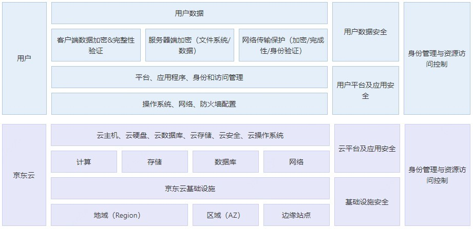

# 6	京东云安全模型 

## 6.1	责任共担模型 

安全性与合规性是京东云和用户共同的责任。京东云负责云平台自身的安全，用户负责云平台上的业务安全。 
京东云负责基础设施、物理设备资源、云操作系统及云服务产品的安全控制和管理，并基于安全合规、高可用最佳实践、安全的云产品及安全服务，构建基础设施、平台及应用和身份管理与资源访问控制的多维立体安全防护体系，并保障其运维运营安全。 
云用户基于京东云提供的服务构建云端应用系统，并运用京东云安全的云产品和安全服务以及安全生态第三方安全产品保护自己的业务系统。云用户负责对在云平台上使用的网络、系统、应用、管理、数据、安全等服务的定制配置、自行部署及运维运营。云用户负责安全的使用云平台，确保业务的安全设计、数据保护、认证加密等必要的安全措施和功能实现，管理好账号密码和人员授权，安全的开发应用、运营业务。 

## 6.2	访问控制 
访问控制（Identity and Access Management， IAM）是京东云提供的一项用户身份管理与资源访问控制服务。用户可以通过使用 IAM 创建、管理子用户，并控制这些子用户访问京东云资源的操作权限。使用访问控制，主账号可以向他人授权管理账户中的资源，而不必共享账户密码或访问秘钥，按需为用户分配所需的最小权限，从而降低企业信息安全风险。 

## 6.3	监控与日志 
云监控（Monitoring）是对用户名下的云资源进行监控和报警的服务，展现各项监控指标情况并对指标设置报警，云监控会通过短信、邮件等方式发送报警通知，还提供当前报警状态和报警历史的查看。通过监控，方便客户了解在京东云上的资源使用情况、性能和运行情况；通过报警，客户可以及时作出反应，保障应用程序的稳定运行。 
日志服务（Log Service）是京东云提供的一站式日志服务平台。提供日志实时采集、日志存储，日志检索，智能分析等功能，协助用户通过日志解决业务运营，业务监控，日志分析等问题。 

## 6.4	网络安全 
在私有网络内，您可以使用 NACL 作为子网级别无状态的安全层，用于控制进出子网的数据流，可以精确到协议和端口粒度，可用作防火墙来控制进出一个或多个子网的流量。没有网络 ACL 的保护或者没有配置访问控制策略，会导致子网中的服务器所有网络端口更容易在互联网上遭受攻击甚至导致被入侵。网络 ACL 可用于对跨子网的东西向访问流量或者进出互联网的南北向访问流量进行过滤。具有相同网络流量控制的子网可以关联同一个网络 
ACL，通过设置出站和入站允许规则，对进出子网的流量进行精确控制。 
 	安全组是一种分布式、有状态的、包过滤虚拟防火墙。安全组用来控制一台或一组云主机、容器、负载均衡等实例出入访问流量，实现实例级的安全控制能力。 
  
## 6.5	数据加密 
云硬盘加密功能基于京东云 KMS 系统，对云硬盘加密，为您提供了一种简单的安全的加密手段，能够对您新创建的云硬盘进行加密处理。您无需构建、维护和保护自己的密钥管理基础设施，您也无需更改任何已有的应用程序，无需做额外的加解密操作，云硬盘加密功能对于您的业务是透明的。产品功能包括： 

- 支持云硬盘中的数据静态加密。 
- 在云硬盘和云主机之间移动的所有数据加密。 
-	从加密硬盘创建的所有快照自动加密。 
-	从这些快照恢复的云硬盘自动加密。 

