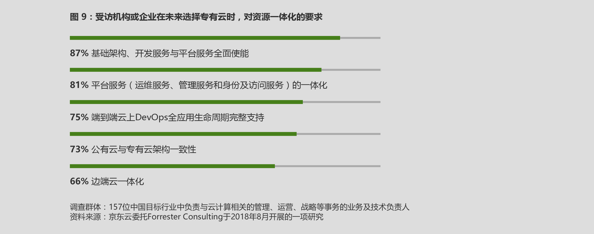

# 政府和企业需要新一代专有云平台

专有云平台的建设已经成为政府和企业的当务之急。面对不断进化的 业务、愈发挑剔的客户以及快速变化的环境，政府和企业需要制订明确的 专有云战略，从业务到IT等多个方面达成对战略目标的一致认知，借助合 作伙伴在专有云方面的技术积累、行业实践以及专业服务能力，构建新一 代专有云平台。结合此次调研，我们认为新一代专有云平台需要具有以下 要素:

## 与公有云平台高效协同

专有云平台能够帮助政府和企业简化IT管理，提供端到端一体化安全 合规、多层次资源一体化赋能、开发运维一体化支持等全方位服务，从而 减少繁杂的运维管理流程，为政府和企业数字化转型提供安全可靠、敏捷 高效的坚实基础。

**端到端安全合规一体化**

端到端的安全合规需要涵盖平台安全、应用安 全、数据安全以及业务安全等层面。在平台层面，需要从安全防护、可 用性以及可靠性等维度，对软件平台、主机平台以及网络互联等进行全 面保护;在应用层面，应注重事前、事中和事后的全周期安全防护; 在数据层面，需要加强数据治理和加密措施，防范各种漏洞风险;在业 务层面，需要借助技术能力以外的经验，建立完善的管控流程并通过技 术手段进行固化。在调研过程中，92%的受访者看重资源访问控制能 力，86%的受访者认为平台的入侵检测、拦截和告警等能力非常重要， 另外有80%的受访者认为平台的安全监控特性是需要重点考察的因素

**图 8：受访机构或企业在未来选择专有云时，主要考虑的安全因素**

**多层次资源一体化**

面对瞬息万变的市场需求、动态的商业环境和全 球化趋势下各种未知的挑战，新一代专有云平台需要面向多层次资源 提供一体化的服务，方便用户整合专有云与公有云，随时按需申请资 源，实现IT资源快速自动部署，并保持部署的一致性和高效性。在调研 中，87%的受访者认为其所在企业或政府机构需要建设从基础平台到开 发服务的一体化云平台，81%的受访者还认为除了平台本身外，更需要 一体化的平台服务来提供混合云管理以及丰富的运营和运维工具。不仅如此，业务的爆发式增长虽然是企业为之努力的目标，但也为 IT人员带来巨大压力，此时企业需要借助公有云的资源和弹性形成对自 身云架构的补充。基于这个出发点，73%的受访者认可企业的专有云需 要与公有云尽量保持一致的架构。此外，在物联网应用即将迎来爆发式 增长的年代，66%的受访者表示，不仅专有云和公有云架构需要保持一 致，边、端、云也都需要提供高效一致的系统支持。

**开发运维一体化**

软件正在重塑世界，软件开发在数字化转型中发挥着更为重要的作用，也将成为实现业务差异化战略的核心竞争力。新一代专有云平台需要对软件开发与系统运维提供一体化服务，从应用的全生命周期考虑，实现全链路打通与自动化，以支持跨部门、跨系统、跨地域的内部协作。从基础架构看，需要将基础环境实现服务化和可编程化，让基础设施从物理机、虚拟机走向容器，形成具备完善服务管理与调度的基础服务层。此次调研中，74%的受访者高度关注专有云对集成DevOps全生命周期的支持。此外，随着系统架构日益复杂，81%的受访者认为专有云平台需要提供包括运维、管理及访问控制在内的一体化运维管控服务。

## 具备企业级专业化品质

政府和企业在数字化转型中，需要构建安全可靠、便捷高效的专有云平台，并获得具备企业级品质的行业应用。因此，政府和企业在建设专有云平台时，需要同时考察专业化解决方案快速落地的能力和不同行业对企业级水准的要求，从而带来平台建设的正向迭代，驱动数字化转型不断深入。

**政府机构**

为了推动资源共享、创新服务模式、避免重复建设、帮助政府实现政务公开和服务转型，国务院和相关部委纷纷发文，加速企业政务云的建设。同时，国家新型智慧城市、“互联网+政务服务”等工作的规划出台，旨在推动各政府部门在政务云平台上，以按需、易扩展的方式实现应用服务、数据及计算资源的高效使用。在此次调研中，超过半数的政府客户表示将利用专有云支撑政府服务系统（59%）以及监管审批系统（56%）。对政府而言，对专有云最为关注的重要指标分别为经过大量验证、保障高性能、稳定性以及弹性（见图10）。

**制造行业**

作为世界第一制造业大国，我国贡献了全球24%的制造业增加值。制造业的转型升级对我国至关重要，“中国制造2025”也彰显了这一雄心。但是，相比而言大多数制造企业的IT基础仍较薄弱，上层应用也有很大提升空间，专业的专有云平台有望为制造业转型带来强劲动力。除了利用专有云对企业信息化基础架构进行升级外，通过对企业研发、生产以及管理流程的标准化和服务虚拟化，进一步助力企业打造制造云，帮助企业向提供高附加值、低成本和全球化制造服务的“新制造”转型。在调研中，80%的受访制造企业反馈其最核心的需求是利用专有云平台实现生产流程的优化，63%的受访制造企业对利用专有云支撑库存管理及交易平台表示关注（见图10）。

**物流行业**

在我国，物流成本高、效率低是一大顽疾，在一定程度上制约着我国经济的健康发展。公开数据显示，全社会物流费用占我国GDP比值的14.9%6，高于发达国家近一倍。造成这一问题的根源在于物流体系产业结构不合理，物流供应链体系不健全，行业IT信息化发展极不均衡，整体物流行业的数字化转型面临着诸多挑战。新一代专有云平台以及创新的应用为物流行业带来了新的希望，将有助于实现产业结构的优化和整体行业效率的提升。例如基于云计算的仓储可视化，在此基础上的多仓协同、需求预测、路径优化等数字化应用都能有效提升运营效率和客户体验。在调研中，70%的受访物流企业看好能够实现高效协同的仓储管理系统，67%的受访物流企业对运输管理系统表示关注（见图10）。

**图 10：不同行业在专有云建设方面的需求**

## 富有新兴技术创新能力

数字化创新是数字化转型的关键组成部分。为了实现这一目标，专有云平台需要通过新兴技术赋能已有场景以实现业务创新，通过提供云原生服务加速应用上线进程，以及通过提供大规模业务场景支持能力满足创新型业务的变现。

**专有云平台需要提供新兴技术服务**

当下，以大数据、人工智能、物联网以及区块链为代表的新兴技术作为重要驱动力为各行各业带来深刻变革。专有云平台作为重要载体，需要具备能够提供大数据服务、深度学习和机器学习建模以及物联网连接管理等能力，从而降低企业或政府机构使用新技术的门槛，迅速释放新兴技术红利。这样不仅可以提高已有的数字化运营能力，更可以深度结合既有业务实现推陈出新，打造经济发展的新增长引擎。在调研中，62%的受访者希望专有云平台能够提供大数据平台以及大数据分析服务，60%的受访者希望专有云平台能够提供人工智能服务。公有云平台在新兴技术方面处在积极引领的位置，专有云平台需要跟上步伐，不断提升自身的先进性（见图11）。

**专有云平台需要提供云原生服务**

云原生应用程序架构能够帮助企业或政府机构让传统IT交付更加敏捷，极大促进创新产品和服务的开发交付，推动数字化转型。现代化的专有云平台需要提供云原生架构领域的一系列技术服务，如容器、容器编排、DevOps、API管理等。在调研中，92%的受访者希望专有云平台提供容器服务，80%的受访者希望专有云平台提供DevOps服务。对于云原生服务，技术服务能力只是一方面，专有云提供商的云原生架构开发经验同样非常可贵（见图11）。

**专有云平台需要提供大规模业务支撑能力**

专有云平台已不再囿于开发测试环境，更需要具备支撑大规模业务的能力。从动态负载感知到迅速扩容以及弹性伸缩都对专有云平台提出了严格的要求。专有云的计算、存储、网络以及数据库、缓存、实时计算、消息队列等服务也将在大规模场景接受考验。可以说大规模业务支持能力集专有云服务之大成，帮助企业支撑数字化创新和数字化转型。这一能力偏重实践，经受过大规模实际业务冲击的专有云架构更具有优势。在调研中，高达85%的受访者对专有云这一能力表示关注（见图11）。

**图 11：选择最合适的技术发展合作伙伴**

## 成就生态体系价值共创

在全球数字化浪潮中，企业逐渐加大在数字化转型上的投入，业务上云已是大势所趋。但企业利用云计算加速数字化转型并非一项简单的工程，完成云平台的部署也仅仅是数字化进程中的一步，企业还需要解决应用重构、数据和应用迁移、云平台管理、云安全综合治理、混合云监控以及多云管理等一系列相关的问题。企业仅依靠自身力量难以在短期内看到效果，甚至可能会面临上云失败的风险，因此需要充分借助合作伙伴的力量。在调研中，88%的受访者看中合作伙伴基于云平台进行数字化转型的能力。合作伙伴覆盖的场景越丰富，提供的数字化转型服务也就具有更好的针对性和启发性。借助合作伙伴的生态能力，企业除了获得云计算平台、技术及专业服务支持，还能充分发掘云平台的生态效应，拓展自身的业务边界，整合价值链资源，实现商业模式的创新突破。因此，从生态能力出发，值得信赖的合作伙伴必须具备以下特质：

**具备丰富的技术实践与服务能力**

企业采用云计算仍面临众多技术层面的实际问题：例如云计算本身的架构以及创新的服务组件仍处于快速发展期，一方面可以看到欣欣向荣的开源生态已经成为众多基础架构建设及应用开发人员的主流选择，但另一方面开源软件难以满足众多企业的个性化需求，仍需要投入大量的资源进行二次开发，对于多数企业而言成为了额外的负担。主流的云计算厂商均通过自身的研发对开源项目做出贡献，从而影响开源项目的发展，推动各种开源项目的成熟。因此合作伙伴必须具有雄厚的研究资源以及持续投入研发的能力，才能为企业提供全面的技术支持。在调研中，超过半数的受访者表示，专有云合作伙伴是否能将企业的需求纳入到研究开源技术的战略目标中，也是其选择专有云合作伙伴的重要考量因素。

**具备影响行业发展的商业生态能力**

云计算已经不再是企业战术上的解决方案，而成为了连接经济体的战略推动者。基于云计算所产生的云生态系统前所未有地将员工、客户、合作伙伴、供应商和设备连接起来，以满足不断提升的客户期望。企业融入云生态后，将从单纯的云计算使用者转变为云生态系统的参与者。云生态系统的强大之处在于，它可以生成聚合信息的分析，帮助企业实现更加智能的商业运作。而且生态系统内的企业可以共享丰富的数据资源，扩充企业所需要的数据，从而实现更加精准的数据分析。合作伙伴与政府以及不同行业之间的协作，将进一步增强生态系统的能力，持续带来丰富的客户和合作伙伴资源，并不断提升生态与平台的影响力。

**拥有广泛的全球合作伙伴与行业客户，持续推动协同价值创新**

数字化的生态系统是实现数字化转型的重要组成部分。在全球化这一大趋势下，广泛的全球合作伙伴网络将为企业提供与各行业客户协同发展和价值创新的机会。在调研中，超过七成的政府和企业表示，在选择合作伙伴时非常看重合作伙伴的生态布局。
